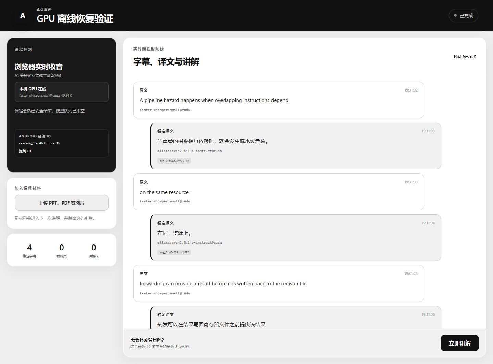
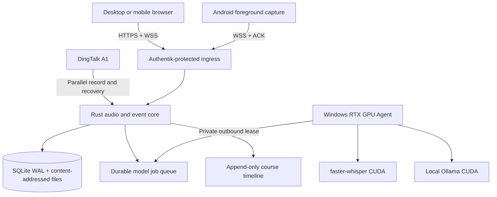

<div align="center">

# AIALRA-LIVE-TRANSLATE

Capture a lecture in one browser page, then use a trusted local GPU to produce live transcripts, Chinese translations, and evidence-linked explanations

[中文](README.md) · [Deployment](deploy/README.md) · [Privacy boundaries](docs/PRIVACY_BOUNDARIES.md) · [Validation](docs/VALIDATION_REPORT.md)

`Public beta` · `Local first` · `RTX CUDA verified` · `中文 / English`



Figure 1  Public synthetic lecture audio processed by `faster-whisper:small@cuda` and `ollama:qwen2.5:14b-instruct@cuda`, with shortened identifiers and stripped image metadata

</div>

## The problem

A student listening to an English lecture should not also have to transcribe, translate, look up unfamiliar terms, organize slides, and preserve notes at the same time

AIALRA puts those actions on one append-only course timeline:

- Capture a microphone, browser tab, or shared system audio from a desktop or mobile browser
- Persist every audio block before acknowledging it, so model downtime cannot block recording or stopping
- Keep ingress, authentication, durable jobs, and events on the server while a trusted RTX GPU Agent claims model work
- Preserve revisions instead of silently overwriting captions, translations, explanations, or corrections
- Add PPTX, PDF, DOCX, image, and text material to later explanations with segment or page evidence
- Use DingTalk A1 as a parallel recorder and post-session recovery source until public evidence establishes continuous third-party PCM access

This is not a covert recording tool  A real session requires confirmed permission and must follow instructor, institutional, and applicable legal requirements

## Verified runtime architecture



Audio ingest, durable storage, acknowledgement, and stop control remain independent from model availability

## First local run

Prerequisites: Windows, Rust 1.95, Node.js 22, pnpm 10, Python 3.12, uv, NVIDIA CUDA, and Ollama

```powershell
Copy-Item .env.example .env
./scripts/start-local.ps1
```

The production UI has no default demo session and no deterministic model fallback  Confirm recording permission, select one audio source, start the course, then use the visible stop control

Remote capture requires HTTPS  Users stay on the same page and do not enter an API address

## Capability status

| Capability | Status | Evidence boundary |
|---|---|---|
| Browser microphone | Available | AudioWorklet, durable server ACK, IndexedDB resend, Chrome and Edge desktop checks |
| Browser tab or shared system audio | Available | `getDisplayMedia` path with a preserved source ID |
| Durable model jobs | Available | SQLite WAL, leases, renewal, retry, idempotent completion, restart recovery |
| Private GPU path | Available | Server queue, private Gateway, DPAPI token, RTX 4080 CUDA Agent |
| Transcript | Available | `faster-whisper:small@cuda`, no production identity fallback |
| Chinese translation and explanation | Available | `ollama:qwen2.5:14b-instruct@cuda`, no deterministic fallback |
| Course material | Available | PPTX, PDF, DOCX, image, Markdown, and text; advanced OCR and VLM remain planned |
| Android | Short device run passed | Foreground service, write-before-send, delete-after-ACK; lock-screen and 90-minute gates remain open |
| DingTalk A1 | Control and recovery path | Public evidence does not establish continuous third-party PCM or incremental transcripts |

## Real model gates

Tested on 2026-08-27 with an RTX 4080 16 GB and public synthetic English lecture audio

| Gate | Result |
|---|---:|
| Local end to end | 21/21 audio ACKs, 4 captions, 4 translations, 1 material page, 1 explanation, 14.2 s total |
| Slowest local ASR window | 1.89 s |
| Slowest local translation | 0.87 s |
| Local explanation | 7.51 s |
| Observed GPU peak | About 12.2 GB VRAM, no OOM |
| Server to private RTX end to end | 21/21 ACKs, 4 captions, 4 translations, 1 material page, 1 explanation, 35.0 s total |
| GPU offline | 21/21 ACKs, zero fake captions, 5 durable queued jobs |
| GPU recovery | 4 captions, 4 translations, zero duplicate captions |
| Core restart with queued jobs | 5 jobs and `processing` survived; zero duplicate captions after recovery |
| Browser layout | Desktop, dark, and 390 px checks passed with zero console warnings or horizontal overflow |

These figures describe one synthetic sample and one hardware profile, not every accent, room, or long lecture

## Private deployment

The hybrid layout lets the server persist audio while the GPU Agent makes an outbound private connection  The server never initiates a connection to a home public address

```powershell
./scripts/initialize-gpu-agent-secret.ps1
./scripts/install-gpu-agent.ps1 -GatewayUrl "http://worker-gateway.example.invalid"
```

The server stores only a token digest, the Windows user keeps the token under DPAPI, public Nginx rejects `/internal/`, and the Worker Gateway binds only to a private interface

See [deployment](deploy/README.md) for boundaries and rollback behavior

## Validation

```powershell
cargo test --workspace
cargo clippy --workspace --all-targets -- -D warnings
pnpm lint
pnpm typecheck
pnpm test
pnpm build
uv run ruff check workers tools
uv run mypy workers tools
uv run pytest
```

Dates, environments, observed timings, and open gates are recorded in [validation](docs/VALIDATION_REPORT.md)

## Data and security

- Recordings, transcripts, course files, tokens, private addresses, and temporary downloads never belong in Git, snapshots, or ordinary logs
- A real session requires a recorded permission confirmation and a continuously visible recording state
- Text and image egress is disabled by default
- User data lives outside immutable releases, so a code rollback does not delete a session
- Repository examples use reserved domains and empty credentials

Use GitHub private security reporting for vulnerabilities  Never attach recordings, tokens, real hostnames, or server details to public issues

## Repository map

- `crates/` contains the Rust state machine, events, durable queue, ingest, and API
- `workers/` contains ASR, translation, explanation, document parsing, and the GPU Agent
- `apps/web/` contains the black-and-white single-page course workspace
- `apps/android/` contains the Android long-session capture client
- `apps/dingtalk-miniapp/` contains A1 control and foreground capability probes
- `deploy/` contains server, Nginx, Authentik, and private Gateway templates
- `docs/` contains decisions, research, privacy, limitations, changes, and validation

## Support and license

Use repository issues for defects and feature requests

This repository currently has no `LICENSE` file  Except where applicable law provides otherwise, no permission is granted to copy, distribute, modify, or use the project commercially
