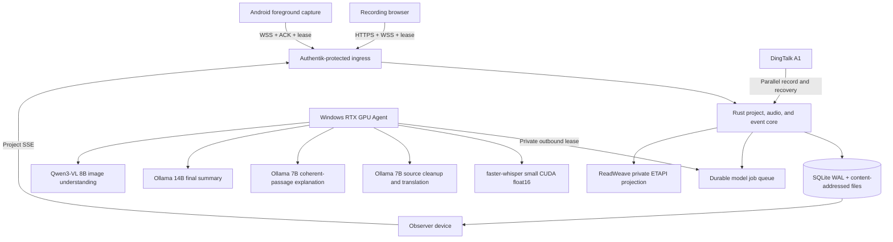

<div align="center">

<h1 align="center">AIALRA-LIVE-TRANSLATE</h1>

Keep one course project synchronized across devices while one recorder sends durable audio to a trusted local GPU for transcripts, Chinese translations, explanations, and ReadWeave notes

[中文](README.md) · [Deployment](deploy/README.md) · [Privacy boundaries](docs/PRIVACY_BOUNDARIES.md) · [Validation](docs/VALIDATION_REPORT.md)

`Public source` · `Continuous workspace` · `Local first` · `RTX CUDA path tested` · `ReadWeave`


Figure 1  Public synthetic lecture audio processed by the real RTX 4080 model path, with a persistent workspace tree, continuous bilingual paragraphs, recording state, GPU telemetry, and stripped metadata

</div>

## 1. The problem

A student listening to an English lecture should not also have to transcribe, translate, look up unfamiliar terms, organize slides, and preserve notes at the same time

AIALRA puts those actions on one append-only course timeline:

- Show the same owner-scoped project, sessions, recording state, and results on every signed-in device
- Allow one active recorder per project while other devices observe and can take over only after lease expiry
- Capture a microphone, browser tab, or shared system audio from a desktop or mobile browser
- Commit unacknowledged browser audio and its next sequence in IndexedDB so refreshes and short outages can resume safely
- Persist every audio block before acknowledging it, then rebuild unfinished ASR windows from durable chunks after a Core restart
- Keep ingress, authentication, durable jobs, and events on the server while a trusted RTX GPU Agent claims model work
- Preserve revisions instead of silently overwriting captions, translations, explanations, or corrections
- Add PPTX, PDF, DOCX, image, and text material to later explanations with segment or page evidence
- Project stable text and evidence into ReadWeave over private ETAPI without overwriting user notes or content outside managed markers
- Use DingTalk A1 as a parallel recorder and post-session recovery source until public evidence establishes continuous third-party PCM access

This is not a covert recording tool  A real session requires confirmed permission and must follow instructor, institutional, and applicable legal requirements

## 2. Verified runtime architecture



Audio ingest, durable storage, acknowledgement, and stop control remain independent from model availability

## 3. First local run

Prerequisites: Windows, Rust 1.95, Node.js 22, pnpm 10, Python 3.12, uv, NVIDIA CUDA, and Ollama

```powershell
ollama pull qwen2.5:7b-instruct # Download source cleanup, translation, and rolling explanation
ollama pull qwen2.5:14b-instruct # Download the final-course-summary model
ollama pull qwen3-vl:8b-instruct # Download the local image-understanding model
Copy-Item .env.example .env # Create a local configuration from reserved example values
./scripts/start-local.ps1 # Build and start the workspace, Core, model Worker, and GPU Agent
```

The supervisor verifies local models and starts Ollama when needed, while the browser remains on one workspace page

The production UI has no default demo session and no deterministic model fallback  Confirm recording permission, select one audio source, start the course, then use the visible stop control

Remote capture requires HTTPS  Users stay on the same page and do not enter an API address

## 4. Capability status

| Capability | Status | Evidence boundary |
|---|---|---|
| Projects and device sync | Available | Authentik stable owner ID, owner isolation, project SSE cursor recovery, Chrome and Edge two-device observation |
| Exclusive recorder | Available | 45 s project lease, 10 s renewal, second-device `409`, generation takeover, old-lease rejection |
| Browser microphone | Available | AudioWorklet, durable server ACK, IndexedDB resend, Chrome and Edge desktop checks |
| Durable audio recovery | Available | Persisted chunks, assembly cursors, 1.5 s minimum speech, 450 ms silence, 5 s cap, tail sealing, and out-of-order recovery |
| Browser tab or shared system audio | Available | `getDisplayMedia` path with a preserved source ID |
| Durable model jobs | Available | SQLite WAL, leases, renewal, retry, idempotent completion, restart recovery |
| Private GPU path | Available | Server queue, private Gateway, DPAPI token, RTX 4080 CUDA Agent |
| Transcript | 90-minute controlled soak passed | `faster-whisper:small@cuda` with float16; provider p95 429 ms and end-to-end p95 727 ms |
| Translation, explanation, and summary | 90-minute controlled soak passed | 7B coherent-paragraph translation and explanation, one 14B post-recording summary; provider p95 1341, 2781, and 17049 ms |
| Course material | Available | PPTX, PDF, DOCX, image, Markdown, and text; Qwen3-VL 8B passed a real OCR and visual explanation gate |
| ReadWeave notes | Available | Private ETAPI, 30 s batching, in-page transcript and translation preview, revisions, managed markers, recovery notes, and user-note protection |
| Android | Short device run passed | Foreground service, write-before-send, delete-after-ACK; lock-screen, call, Bluetooth, and Wi-Fi gates remain open |
| DingTalk A1 | Control and recovery path | Public evidence does not establish continuous third-party PCM or incremental transcripts |

## 5. Current validation status

The current evidence was collected on 2026-08-31 on Windows with an RTX 4080 16 GB and controlled HTTPS synthetic English lecture audio  The models and infrastructure are real

| Check | Current result | Status |
|---|---:|---|
| Project sync and exclusive lease | Same-user views match, cross-user `404`, second recorder `409`, and takeover increments generation | Short run passed |
| Durable audio and recovery | Reordering, exact retransmission, and Core restart recover without duplicate paragraphs | Short run passed |
| Identity and origin isolation | Proxy marker, Origin, cross-project IDOR, legacy start, and old-lease WebSocket are rejected | Automated checks passed |
| One-minute runtime-proof network audio | 60/60 ACK, normal-network ACK p95 7 ms, ASR p95 1420 ms, translation p95 1624 ms, 14B summary 16798 ms, GPU OOM 0 | Short run passed |
| Browser two-device flow | Observation, outage cache, refresh recovery, and all ACKs passed with 9 stable paragraphs and 3 translations | Short run passed |
| 30-minute network audio | 1782/1782 ACK, 134 coherent paragraphs, 134 translations, 22 teaching blocks, 14B summary 18737 ms, duplicate paragraphs and OOM 0 | Preflight passed |
| 90-minute network audio | 5345/5345 ACK, 401 coherent paragraphs and translations, 66 teaching blocks, one 14B summary, three outage recoveries, zero duplicates, failures, and GPU OOM | Formal gate passed |
| 6-hour and 24-hour gates | Not executed under the current protocol | Not executed |

An earlier 90-minute run produced a final summary in about 291 seconds, exceeding both the 30-second synchronous budget and the 120-second asynchronous budget  It remains failure evidence  The latest formal run completed its summary in 17049 ms

See [validation](docs/VALIDATION_REPORT.md) for historical measurements and reproduction commands

## 6. Private deployment

The hybrid layout lets the server persist audio while the GPU Agent makes an outbound private connection  The server never initiates a connection to a home public address

```powershell
./scripts/initialize-gpu-agent-secret.ps1 # Generate and protect the Worker token with Windows DPAPI
./scripts/install-gpu-agent.ps1 -GatewayUrl "http://worker-gateway.example.invalid" # Install login startup against a reserved private Gateway example
```

The server stores only a token digest, the Windows user keeps the token under DPAPI, public Nginx rejects `/internal/`, and the Worker Gateway binds only to a private interface

Production Core accepts only the stable Authentik identity overwritten by the trusted reverse proxy  ReadWeave ETAPI remains on the private container network and its token is never sent to a browser

See [deployment](deploy/README.md) for boundaries and rollback behavior

## 7. Validation

```powershell
cargo test --workspace # Run Rust unit and integration tests
cargo clippy --workspace --all-targets -- -D warnings # Treat Rust lints as failures
pnpm lint # Check web code style
pnpm typecheck # Check TypeScript types
pnpm test # Run web tests
pnpm build # Produce the production web build
uv run ruff check workers tools # Check Python code style
uv run mypy workers tools # Check Python types
uv run pytest # Run Python tests
```

Dates, environments, observed timings, and open gates are recorded in [validation](docs/VALIDATION_REPORT.md)

## 8. Data and security

- Recordings, transcripts, course files, tokens, private addresses, and temporary downloads never belong in Git, snapshots, or ordinary logs
- A real session requires a recorded permission confirmation and a continuously visible recording state
- Text and image egress is disabled by default
- User data lives outside immutable releases, so a code rollback does not delete a session
- Repository examples use reserved domains and empty credentials

Use GitHub private security reporting for vulnerabilities  Never attach recordings, tokens, real hostnames, or server details to public issues

## 9. Repository map

| Path | Responsibility |
|---|---|
| `crates/` | Rust state machine, events, durable queue, ingest, and API |
| `workers/` | ASR, translation, explanation, document parsing, and the GPU Agent |
| `apps/web/` | Black-and-white single-page course workspace |
| `apps/android/` | Android long-session capture client |
| `apps/dingtalk-miniapp/` | A1 control and foreground capability probes |
| `deploy/` | Server, Nginx, Authentik, and private Gateway templates |
| `docs/` | Decisions, research, privacy, limitations, changes, and validation |
| `docs/READWEAVE_INTEGRATION.md` | Note layout, projection scope, conflict handling, and recovery |
| `docs/ARCHITECTURE_MENTAL_MODEL.md` | Complete recording, ACK, model, device-sync, and note flow |
| `docs/MODEL_ROUTING.md` | 7B, 14B, VLM, and per-item cloud authorization boundaries |

## 10. Support and license

Use repository issues for defects and feature requests

This repository currently has no `LICENSE` file  Except where applicable law provides otherwise, no permission is granted to copy, distribute, modify, or use the project commercially
