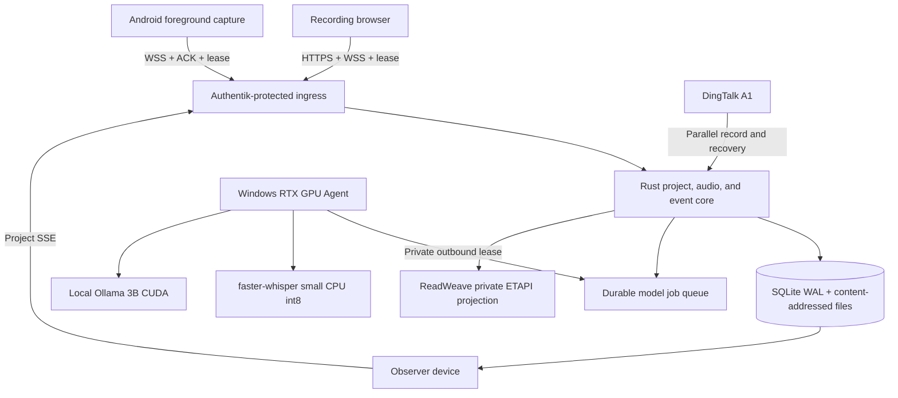

<div align="center">

# AIALRA-LIVE-TRANSLATE

Keep one course project synchronized across devices while one recorder sends durable audio to a trusted local GPU for transcripts, Chinese translations, explanations, and ReadWeave notes

[中文](README.md) · [Deployment](deploy/README.md) · [Privacy boundaries](docs/PRIVACY_BOUNDARIES.md) · [Validation](docs/VALIDATION_REPORT.md)

`Public beta` · `Local first` · `RTX CUDA verified` · `Multi-device sync` · `ReadWeave`


Figure 1  Public synthetic lecture audio processed by `faster-whisper:small@cpu` and `ollama:qwen2.5:3b-instruct@cuda`, with synchronized ReadWeave preview, hidden runtime identifiers, and stripped metadata

</div>

## The problem

A student listening to an English lecture should not also have to transcribe, translate, look up unfamiliar terms, organize slides, and preserve notes at the same time

AIALRA puts those actions on one append-only course timeline:

- Show the same owner-scoped project, sessions, recording state, and results on every signed-in device
- Allow one active recorder per project while other devices observe and can take over only after lease expiry
- Capture a microphone, browser tab, or shared system audio from a desktop or mobile browser
- Commit unacknowledged browser audio and its next sequence in IndexedDB so refreshes and short outages can resume safely
- Persist every audio block before acknowledging it, then rebuild unfinished ASR windows from durable chunks after a Core restart
- Keep ingress, authentication, durable jobs, and events on the server while a trusted RTX GPU Agent claims model work
- Preserve revisions instead of silently overwriting captions, translations, explanations, or corrections
- Add PPTX, PDF, DOCX, image, and text material to later explanations with segment or page evidence
- Project stable text and evidence into ReadWeave over private ETAPI without overwriting user notes or content outside managed markers
- Use DingTalk A1 as a parallel recorder and post-session recovery source until public evidence establishes continuous third-party PCM access

This is not a covert recording tool  A real session requires confirmed permission and must follow instructor, institutional, and applicable legal requirements

## Verified runtime architecture



Audio ingest, durable storage, acknowledgement, and stop control remain independent from model availability

## First local run

Prerequisites: Windows, Rust 1.95, Node.js 22, pnpm 10, Python 3.12, uv, NVIDIA CUDA, and Ollama

```powershell
ollama pull qwen2.5:3b-instruct
setx OLLAMA_NUM_PARALLEL 2
Copy-Item .env.example .env
./scripts/start-local.ps1
```

Restart Ollama after setting its parallel request limit

The production UI has no default demo session and no deterministic model fallback  Confirm recording permission, select one audio source, start the course, then use the visible stop control

Remote capture requires HTTPS  Users stay on the same page and do not enter an API address

## Capability status

| Capability | Status | Evidence boundary |
|---|---|---|
| Projects and device sync | Available | Authentik stable owner ID, owner isolation, project SSE cursor recovery, Chrome and Edge two-device observation |
| Exclusive recorder | Available | 45 s project lease, 10 s renewal, second-device `409`, generation takeover, old-lease rejection |
| Browser microphone | Available | AudioWorklet, durable server ACK, IndexedDB resend, Chrome and Edge desktop checks |
| Durable audio recovery | Available | Persisted chunks, assembly cursors, 2–8 s windows, tail sealing, out-of-order recovery, exact duplicate validation |
| Browser tab or shared system audio | Available | `getDisplayMedia` path with a preserved source ID |
| Durable model jobs | Available | SQLite WAL, leases, renewal, retry, idempotent completion, restart recovery |
| Private GPU path | Available | Server queue, private Gateway, DPAPI token, RTX 4080 CUDA Agent |
| Transcript | Available | `faster-whisper:small@cpu`, 12 threads and elevated Worker priority passed the 30-minute gate |
| Chinese translation and explanation | Available | `ollama:qwen2.5:3b-instruct@cuda`, separate translation and explanation leases, no deterministic fallback |
| Course material | Available | PPTX, PDF, DOCX, image, Markdown, and text; advanced OCR and VLM remain planned |
| ReadWeave notes | Available | Private ETAPI, 30 s batching, in-page transcript and translation preview, revisions, managed markers, recovery notes, and user-note protection |
| Android | Short device run passed | Foreground service, write-before-send, delete-after-ACK; lock-screen and 90-minute gates remain open |
| DingTalk A1 | Control and recovery path | Public evidence does not establish continuous third-party PCM or incremental transcripts |

## Real model gates

Tested on 2026-08-29 with an RTX 4080 16 GB, public synthetic English lecture audio, small CPU ASR, and a local 3B CUDA model

| Gate | Result |
|---|---:|
| 30-minute small CPU run | 1183 audio chunks, 179 captions, 179 translations, 35 explanations, zero gaps, duplicates, failures, or OOM |
| 30-minute p95 | Worker 0.246 s, ASR 2.739 s, translation 1.209 s, explanation 2.297 s |
| Browser outage recovery | Chrome 5, 15, and 60 s plus Edge 5 s all recovered with zero pending audio |
| Multi-device recording lease | Second device received `409`; takeover after 45 s incremented generation and rejected the old lease |
| Reordered and repeated audio | Sequence 2 before 1 recovered one contiguous window; exact retransmission did not duplicate storage |
| Core restart | A partial tail survived restart and two chunks produced one final caption |
| GPU Agent and private network | Agent restarted automatically; work resumed after a 30 s Gateway outage |
| ReadWeave recovery | Jobs queued during a 45 s outage and caught up with zero conflicts |
| 90-minute browser integrity | 4573 chunks, 686 captions, 686 translations, zero gaps, duplicates, failures, or OOM after fault injection |
| 90-minute cumulative performance | Failed because external CPU contention pushed Worker and ASR p95 beyond their gates |
| 30-minute small CPU performance | The enforced database gate passed; this is the current default |

These figures describe one synthetic sample and one hardware profile, not every accent, room, or pending long-run gate

## Private deployment

The hybrid layout lets the server persist audio while the GPU Agent makes an outbound private connection  The server never initiates a connection to a home public address

```powershell
./scripts/initialize-gpu-agent-secret.ps1
./scripts/install-gpu-agent.ps1 -GatewayUrl "http://worker-gateway.example.invalid"
```

The server stores only a token digest, the Windows user keeps the token under DPAPI, public Nginx rejects `/internal/`, and the Worker Gateway binds only to a private interface

Production Core accepts only the stable Authentik identity overwritten by the trusted reverse proxy  ReadWeave ETAPI remains on the private container network and its token is never sent to a browser

See [deployment](deploy/README.md) for boundaries and rollback behavior

## Validation

```powershell
cargo test --workspace
cargo clippy --workspace --all-targets -- -D warnings
pnpm lint
pnpm typecheck
pnpm test
pnpm build
uv run ruff check workers tools
uv run mypy workers tools
uv run pytest
```

Dates, environments, observed timings, and open gates are recorded in [validation](docs/VALIDATION_REPORT.md)

## Data and security

- Recordings, transcripts, course files, tokens, private addresses, and temporary downloads never belong in Git, snapshots, or ordinary logs
- A real session requires a recorded permission confirmation and a continuously visible recording state
- Text and image egress is disabled by default
- User data lives outside immutable releases, so a code rollback does not delete a session
- Repository examples use reserved domains and empty credentials

Use GitHub private security reporting for vulnerabilities  Never attach recordings, tokens, real hostnames, or server details to public issues

## Repository map

- `crates/` contains the Rust state machine, events, durable queue, ingest, and API
- `workers/` contains ASR, translation, explanation, document parsing, and the GPU Agent
- `apps/web/` contains the black-and-white single-page course workspace
- `apps/android/` contains the Android long-session capture client
- `apps/dingtalk-miniapp/` contains A1 control and foreground capability probes
- `deploy/` contains server, Nginx, Authentik, and private Gateway templates
- `docs/` contains decisions, research, privacy, limitations, changes, and validation
- `docs/READWEAVE_INTEGRATION.md` defines note layout, projection scope, conflict handling, and recovery

## Support and license

Use repository issues for defects and feature requests

This repository currently has no `LICENSE` file  Except where applicable law provides otherwise, no permission is granted to copy, distribute, modify, or use the project commercially
