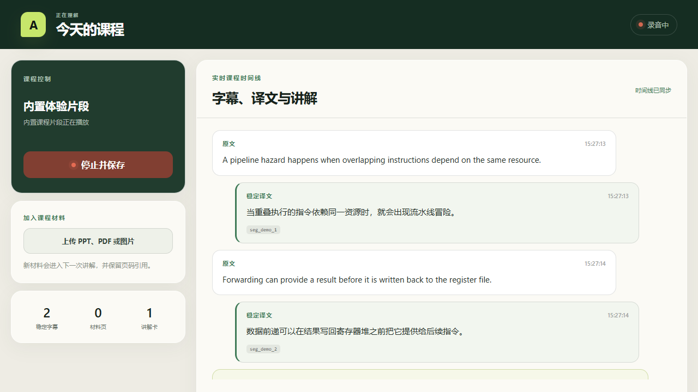
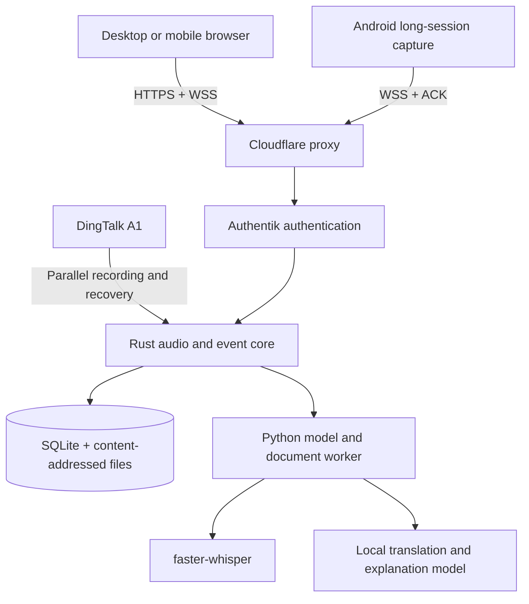

# AIALRA-LIVE-TRANSLATE

> A live learning workspace for lectures: capture audio in the browser and build one timeline of transcripts, Chinese translations, explanations, and slide references.

[中文](README.md) · [Deployment](deploy/README.md) · [Privacy boundaries](docs/PRIVACY_BOUNDARIES.md) · [Validation](docs/VALIDATION_REPORT.md)

Status: runnable single-user vertical slice. Browser, Android, and DingTalk A1 are separate capture paths. The browser is the primary low-friction path; A1 remains a high-quality parallel recording and post-session recovery source.



Figure 1. Sanitized built-in lesson with no real recording, account, hostname, or course material.

## What it does

- Uses a desktop or mobile browser microphone without requiring an app install.
- Numbers every audio chunk and acknowledges it only after durable server storage.
- Stores finalized captions, translations, explanations, and corrections as append-only events.
- Adds PPT, PDF, DOCX, image, and text material to later explanations with page evidence.
- Prioritizes recording control and accepted audio over model work.
- Keeps third-party model egress disabled by default and protects production access with Authentik.

This is not a covert recording tool. It does not replace instructor permission, institutional policy, or applicable law. Real recording requires an explicit permission confirmation.

## Architecture



Figure 2. The protected core persists and acknowledges audio independently of model availability.

## First local run

Prerequisites: Windows, Rust 1.95, Node.js 22, pnpm 10, Python 3.12, and uv. Ollama is required for local model translation.

```powershell
Copy-Item .env.example .env
./scripts/start-local.ps1
```

Keep the built-in lesson enabled for a microphone-free walkthrough. For real capture, disable the demo, confirm permission, select an input device, start the session, and use “Stop and save” when finished.

Browser capture requires `localhost` or an HTTPS secure context. The remote deployment uses same-origin HTTPS, SSE, and WSS, so users do not enter an API address.

## Capability status

| Capability | Status | Evidence boundary |
|---|---|---|
| Browser microphone | Available | 16 kHz mono PCM, sequence, ACK, reconnect; extended desktop runs remain pending |
| VPS presentation | Deployment-ready | Compose, CPU ASR, local small model, Nginx, Authentik, and Cloudflare DNS automation |
| Android | Short device run passed | Foreground service, write-before-send, delete-after-ACK, notification stop; 90-minute run pending |
| DingTalk A1 | Control and recovery path | Public APIs do not establish third-party continuous PCM or incremental transcript access |
| Live transcript | Available | Verified on local GPU; VPS CPU performance needs an online benchmark |
| Chinese translation and explanation | Available | Local Ollama when healthy; source text and evidence remain on failure |
| Course material | Available | PPTX, PDF, DOCX, images, and text; advanced OCR/VLM remains planned |

## Deployment modes

- Local: models and data stay on the user workstation.
- VPS presentation: access from any browser; the VPS provides ingress, persistence, CPU ASR, and a small local model.
- Hybrid production: the VPS always owns ingest, ACK, and recovery while a trusted GPU worker claims persisted model jobs over a private outbound connection.

Do not treat a CPU-only demonstration as a production latency result. See [deployment](deploy/README.md) for the order of operations and rollback boundaries.

## Validation

```powershell
cargo test --workspace
cargo clippy --workspace --all-targets -- -D warnings
pnpm lint
pnpm typecheck
pnpm test
pnpm build
./.venv/Scripts/python.exe -m pytest
```

The current automated set covers 10 Rust, 6 Python, 4 web, 1 DingTalk mini-app, and 1 Android check. Dates, environments, and open gates are tracked in [validation](docs/VALIDATION_REPORT.md).

## Data and security

- Recordings, transcripts, course files, tokens, and temporary download URLs never belong in Git, snapshots, or ordinary logs.
- Production binds to a loopback port; Nginx overwrites identity headers and delegates access to Authentik.
- Persistent user data lives outside immutable releases, so code rollback does not delete a session.
- Text and image egress is disabled by default and still requires server and session policy when enabled.
- Examples use reserved domains and empty credentials; there is no shared demo account.

Report security issues through a private maintainer channel. Do not attach recordings, tokens, real hostnames, or server details to public issues.

## Repository map

- `crates/`: Rust domain, event, persistence, ingest, and API components.
- `workers/`: ASR, translation, explanation, and document parsing.
- `apps/web/`: browser course console.
- `apps/android/`: Android long-session capture client.
- `apps/dingtalk-miniapp/`: A1 control and foreground capability probe.
- `deploy/`: reproducible VPS, Nginx, Authentik, and Cloudflare configuration.
- `docs/`: decisions, research, limitations, changes, and validation records.

## Support and license

Use repository issues for defects and feature requests. This is currently an internal project with no open-source license. No permission to copy, distribute, or use commercially is granted without explicit authorization from the rights holder.
