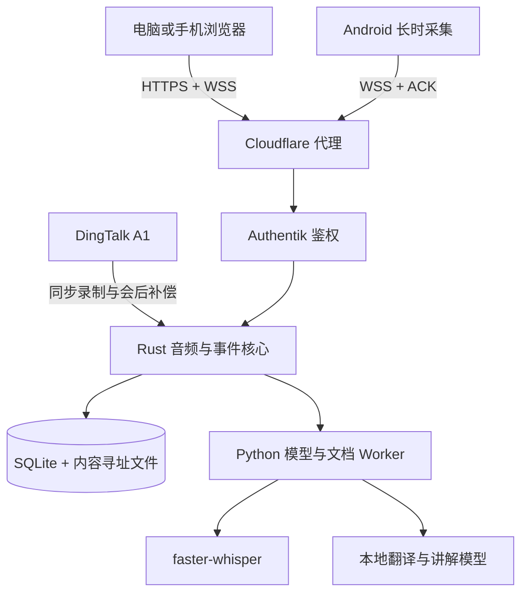

# AIALRA-LIVE-TRANSLATE

> 面向课程与讲座的实时理解工作台：浏览器直接收音，持续生成原文、中文译文、补充讲解和课件引用。

[English](README.en.md) · [部署说明](deploy/README.md) · [隐私边界](docs/PRIVACY_BOUNDARIES.md) · [验证记录](docs/VALIDATION_REPORT.md)

当前状态：可运行的单用户纵向切片。浏览器、Android 和 DingTalk A1 是不同采集入口；浏览器是当前最方便的主入口，A1 保留为高质量同步录音与会后补偿链路。


图 1. 脱敏后的内置课程体验，不包含真实录音、账户、域名或课件。

## 它解决什么问题

听英文课程时，用户不应同时承担听写、翻译、生词查询、课件整理和笔记归档。AIALRA-LIVE-TRANSLATE 把这些动作放进同一条课程时间线：

- 电脑或手机无需安装应用，打开受保护的 HTTPS 页面即可选择麦克风；
- 音频块带序号发送，服务器完成持久化后才返回确认；
- 稳定字幕、中文译文和解释卡采用追加式事件，旧结果不会被静默覆盖；
- PPT、PDF、DOCX、图片与文本进入下一轮讲解，并保留字幕或页码证据；
- 录音停止优先于模型任务，系统会排空已经接收的任务后完成会话；
- 第三方模型出口默认关闭，生产入口由 Authentik 保护。

本项目不是隐蔽录音工具，也不保证代替教师许可、学校政策或适用法律。真实录音前必须确认已获得许可。

## 运行结构



图 2. 浏览器音频先经受保护入口到达核心服务，ACK、落盘和停止控制不依赖模型是否可用。

## 第一次运行

前置条件：Windows、Rust 1.95、Node.js 22、pnpm 10、Python 3.12、uv；需要真实本地翻译时还需 Ollama。

```powershell
Copy-Item .env.example .env
./scripts/start-local.ps1
```

打开脚本给出的本地地址后：

1. 保留“内置课程片段”可在不启用麦克风时查看完整时间线；
2. 取消体验片段并勾选录音许可，可选择电脑、USB 麦克风或系统默认输入；
3. 点击“开始理解”，浏览器显示红色录音状态和服务器确认状态；
4. 点击“停止并保存”，等待界面显示会话完成。

浏览器实录必须位于 `localhost` 或 HTTPS 安全环境。远程部署使用同源 HTTPS、SSE 和 WSS，不需要在网页中填写服务器地址。

## 当前能力

| 能力 | 当前状态 | 证据边界 |
|---|---|---|
| 浏览器麦克风 | 可用 | 16 kHz 单声道 PCM、序号、ACK、断线重发；桌面长时测试仍待完成 |
| VPS 展示 | 部署包已具备 | Compose、CPU ASR、本地小模型、Nginx、Authentik 与 Cloudflare DNS 自动化 |
| Android | 已完成真机短测 | 前台服务、先落盘、ACK 后删除、通知栏停止；尚未完成 90 分钟测试 |
| DingTalk A1 | 控制与补偿链路 | 公开接口未证明第三方连续 PCM 或增量逐字稿能力 |
| 实时字幕 | 可用 | 本地 GPU 已验证；VPS CPU 配置需以线上基准为准 |
| 中文翻译与讲解 | 可用 | Ollama 可用时走本地模型，失败时保留原文和证据关系 |
| 课程材料 | 可用 | 支持 PPTX、PDF、DOCX、图片和文本；高级 OCR/VLM 仍在规划 |

## 部署选择

- 本机模式：模型与数据都在使用者电脑上，适合最高隐私和 GPU 实时处理。
- VPS 展示模式：浏览器随处可用，VPS 负责入口、持久化、CPU ASR 和轻量模型，适合当前演示。
- 混合生产模式：VPS 永远负责接收、ACK 和恢复；受信任的 GPU Worker 通过私有出站连接领取模型任务，适合长课和更高质量模型。

VPS 没有 GPU 时，不应把 CPU 展示结果写成生产性能结论。完整操作顺序、回滚边界和资源说明见 [VPS 部署说明](deploy/README.md)。

## 验证

```powershell
cargo test --workspace
cargo clippy --workspace --all-targets -- -D warnings
pnpm lint
pnpm typecheck
pnpm test
pnpm build
./.venv/Scripts/python.exe -m pytest
```

当前自动检查覆盖 Rust 10 项、Python 6 项、网页 4 项、DingTalk 小程序 1 项和 Android 1 项。具体运行日期、环境与未通过门禁见 [验证记录](docs/VALIDATION_REPORT.md)。

## 数据与安全

- 录音、逐字稿、课件、令牌和临时下载地址禁止进入 Git、测试快照和普通日志；
- 生产服务只绑定 VPS 回环端口，由 Nginx 覆盖身份头并接入 Authentik；
- 录音、字幕和材料保存在独立私有数据目录，代码回滚不会删除用户数据；
- 云端文本与图片出口默认关闭，启用时仍需服务端策略和会话级授权；
- 仓库示例只使用保留域名和空凭据，不提供共享演示账号。

发现安全问题时，请通过仓库维护者的私密渠道报告，不要在公开 Issue 中附带录音、令牌、真实域名或服务器信息。

## 项目目录

- `crates/`：Rust 领域状态、事件、持久化、音频接收与本地 API；
- `workers/`：ASR、翻译、讲解和材料解析；
- `apps/web/`：浏览器课程控制台；
- `apps/android/`：Android 长时采集客户端；
- `apps/dingtalk-miniapp/`：DingTalk A1 控制与前台能力探针；
- `deploy/`：可复现的 VPS、Nginx、Authentik 和 Cloudflare 配置；
- `docs/`：决策、研究、限制、变更和验证记录。

## 支持与许可

问题和功能建议通过本仓库 Issue 跟踪。代码当前为内部项目，仓库未提供开源许可证；未经权利人明确授权，不授予复制、分发或商用许可。
