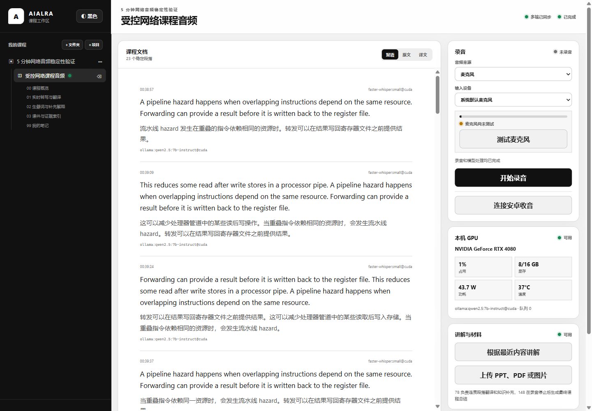
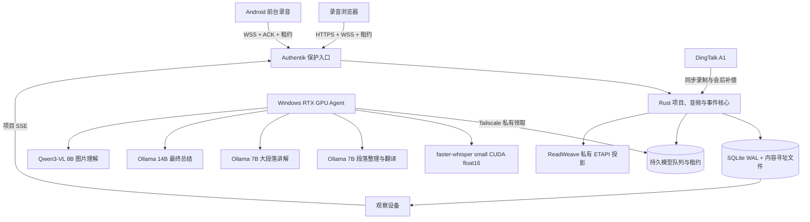

<div align="center">

<h1 align="center">AIALRA-LIVE-TRANSLATE</h1>

同一课程项目可由多台设备同步查看，唯一录音设备把音频安全送往本机 GPU，持续生成字幕、中文译文、补充讲解和 ReadWeave 笔记

[English](README.en.md) · [部署说明](deploy/README.md) · [隐私边界](docs/PRIVACY_BOUNDARIES.md) · [验证记录](docs/VALIDATION_REPORT.md)

`Public source` · `Continuous workspace` · `Local first` · `RTX CUDA path tested` · `ReadWeave`



图 1　公开合成课程音频经真实 RTX 4080 模型链路处理后的工作区，画面同时显示项目树、连续双语段落、录音状态和 GPU 遥测，图片元数据已移除

</div>

## 1. 它解决什么问题

听英文课程时，用户不应同时承担听写、翻译、生词查询、课件整理和笔记归档

AIALRA 把这些动作放进同一条课程时间线：

- 同一个 Authentik 用户可在电脑、手机和观察设备上看到一致的项目、会话和处理状态
- 同一项目只有一个有效录音租约，其他设备保持实时观察，租约过期后才允许接管
- 电脑或手机浏览器直接采集麦克风、标签页或系统共享音频
- 浏览器把未确认音频和下一序号放进同一个 IndexedDB 事务，刷新与短时断网后继续补传
- 音频块先持久化再 ACK，Core 重启后从持久块和游标重建 ASR 窗口
- VPS 只负责入口、身份验证、持久队列和事件，RTX GPU Agent 主动领取任务
- 稳定字幕、译文、讲解和人工修订采用追加式事件，旧结果不会被静默覆盖
- PPT、PDF、DOCX、图片和文本进入后续讲解，并保留字幕或页码证据
- ReadWeave 通过私有 ETAPI 接收可重建笔记投影，人工笔记和管理区外内容不会被覆盖
- DingTalk A1 可作为同步录音和会后补偿来源，公开接口尚未证明连续第三方 PCM 能力

本项目不是隐蔽录音工具，真实录音前必须确认已经获得许可，并遵守课程、学校和适用法律要求

## 2. 已验证的运行结构



音频接收、落盘、ACK 和停止控制不等待模型，GPU 离线时任务保持排队，不生成 identity 或 deterministic 占位结果

## 3. 第一次本地运行

前置条件如下

- Windows 与 NVIDIA CUDA
- Rust 1.95
- Node.js 22 与 pnpm 10
- Python 3.12 或 3.13 与 uv
- Ollama

先准备本地模型：

```powershell
ollama pull qwen2.5:7b-instruct # 下载段落整理、翻译与滚动讲解模型
ollama pull qwen2.5:14b-instruct # 下载最终课程总结模型
ollama pull qwen3-vl:8b-instruct # 下载本地图片理解模型
```

再启动完整本地链路：

```powershell
Copy-Item .env.example .env # 从保留示例值创建本地配置
./scripts/start-local.ps1 # 构建并启动单页工作区、Core、模型 Worker 和 GPU Agent
```

守护脚本会验证本地模型并主动启动 Ollama，只打开一个课程工作台页面

首次可观察结果：

- 第一步，勾选“我已获得课程录音许可”

- 第二步，选择麦克风或浏览器标签或系统共享音频

- 第三步，点击“开始录音”，确认红色录音状态和音频 ACK 状态

- 第四步，朗读或播放公开测试材料，等待字幕和译文显示实际 CUDA Provider

- 第五步，点击“停止并完成处理”，界面会区分“录音已停止”和“模型处理完成”

浏览器实录需要 `localhost` 或 HTTPS 安全环境

## 4. 当前能力

| 能力 | 当前状态 | 证据边界 |
|---|---|---|
| 项目与多端同步 | 可用 | Authentik 稳定用户标识、所有者隔离、项目 SSE 游标恢复、Chrome 与 Edge 双设备观察 |
| 单录音设备 | 可用 | 45 秒项目租约、10 秒续期、第二设备 `409`、过期接管递增代次、旧租约拒绝 |
| 浏览器收音 | 可用 | AudioWorklet、16 kHz 单声道 PCM、序号、ACK、IndexedDB 未确认块恢复 |
| 音频重启恢复 | 可用 | 持久音频块、装配游标、1.5 秒最小语音、450 毫秒静音、5 秒上限、尾部封存和乱序补传 |
| 私有 GPU 链路 | 可用 | VPS 持久队列、60 秒租约、20 秒续租、Tailscale 私有 Gateway、DPAPI 令牌 |
| 实时字幕 | 90 分钟受控长测通过 | `faster-whisper:small@cuda`，Provider p95 为 429 毫秒，端到端 p95 为 727 毫秒 |
| 翻译、讲解与总结 | 90 分钟受控长测通过 | 7B 按连贯段落翻译和讲解，14B 在停止后只总结一次；Provider p95 分别为 1341、2781 和 17049 毫秒 |
| 课程材料 | 可用 | PPTX、PDF、DOCX、图片和文本；Qwen3-VL 8B 已通过真实 OCR 与视觉解释门禁 |
| ReadWeave 笔记 | 可用 | 私有 ETAPI、30 秒批次、同页原文／译文预览、修订、管理标记、冲突恢复副本和用户笔记保护 |
| Android | 短时真机通过 | 前台服务、先落盘、ACK 后删除；锁屏、来电、蓝牙和 Wi-Fi 切换门禁未完成 |
| DingTalk A1 | 控制与补偿链路 | 公开资料未证明第三方连续 PCM 或增量逐字稿能力 |
| 摄像头与自动截屏 | 规划中 | 默认关闭，尚未进入生产路径 |

## 5. 当前验证状态

2026-08-31 的当前证据来自 Windows、RTX 4080 16 GB 和受控 HTTPS 合成英语课程音频，模型与基础设施均为真实实现

| 检查 | 当前结果 | 状态 |
|---|---:|---|
| 项目同步与单录音租约 | 同用户视图一致，跨用户 `404`，第二设备 `409`，过期接管递增 generation | 已通过短测 |
| 音频持久化与恢复 | 乱序、精确重传和 Core 重启均恢复，重复段落为 0 | 已通过短测 |
| 身份与来源隔离 | 代理标记、Origin、跨项目 IDOR、旧启动接口和旧租约 WebSocket 均拦截 | 已通过自动检查 |
| 1 分钟运行证明网络音频 | 60/60 ACK，正常网络 ACK p95 7 毫秒，ASR p95 1420 毫秒，翻译 p95 1624 毫秒，14B 总结 16798 毫秒，GPU OOM 0 | 已通过短测 |
| 浏览器双设备 | 观察、断网缓存、刷新恢复和全部 ACK 通过，9 个稳定段落、3 个稳定译文 | 已通过短测 |
| 30 分钟网络音频 | 1782/1782 ACK，134 个连贯段落，134 个译文，22 个教学块，14B 总结 18737 毫秒，重复段落与 OOM 0 | 已通过预检 |
| 90 分钟网络音频 | 5345/5345 ACK，401 个连贯段落和译文，66 个教学块，1 份 14B 总结，三次断网恢复，重复、失败和 GPU OOM 为 0 | 已通过正式门 |
| 6 小时和 24 小时 | 尚未按当前协议执行 | 未执行 |

早期一次 90 分钟运行的最终总结约 291 秒，超过 30 秒同步预算和 120 秒异步预算，因此保留为失败证据；最新正式轮次已在 17049 毫秒完成总结，旧版本的详细数字请按 [验证记录](docs/VALIDATION_REPORT.md) 中的历史证据阅读

复现入口见 [验证记录](docs/VALIDATION_REPORT.md)、`tools/e2e_smoke.mjs` 和 `tools/network_audio_soak.mjs`

## 6. 私有部署

混合部署由 VPS 持久接收音频，本机 GPU Agent 主动领取任务，VPS 不访问家庭公网地址

初始化 Windows DPAPI 令牌并安装登录自启动：

```powershell
./scripts/initialize-gpu-agent-secret.ps1 # 生成并使用 Windows DPAPI 保存 Worker 令牌
./scripts/install-gpu-agent.ps1 -GatewayUrl "http://worker-gateway.example.invalid" # 安装登录自启动并绑定私有 Gateway 示例地址
```

VPS 只保存令牌 SHA-256 摘要，公开 Nginx 对 `/internal/` 固定拒绝，Worker Gateway 只绑定私有网络接口

生产 Core 只接受反向代理覆盖写入的 Authentik 稳定用户标识；ReadWeave ETAPI 只在私有容器网络开放，浏览器永远不会收到 ETAPI Token

完整部署和回滚边界见 [部署说明](deploy/README.md)

## 7. 验证

```powershell
cargo test --workspace # 运行 Rust 单元与集成测试
cargo clippy --workspace --all-targets -- -D warnings # 把 Rust 静态检查提醒视为失败
pnpm lint # 检查网页代码规范
pnpm typecheck # 检查 TypeScript 类型
pnpm test # 运行网页测试
pnpm build # 生成生产网页构建
uv run ruff check workers tools # 检查 Python 代码规范
uv run mypy workers tools # 检查 Python 类型
uv run pytest # 运行 Python 测试
```

## 8. 数据与安全

- 录音、逐字稿、课件、令牌、私有地址和临时下载链接禁止进入 Git、测试快照和普通日志
- 真实录音必须先记录许可确认，并持续显示录音状态和停止入口
- 本地模式默认关闭云端文本与图片出口
- 原始数据位于独立私有目录，代码回滚不会删除用户会话
- 示例只使用合成内容、保留域名和空凭据

发现安全问题时，请使用 GitHub 的私密安全报告，不要在公开 Issue 附带录音、令牌、真实地址或服务器信息

## 9. 项目目录

| 路径 | 职责 |
|---|---|
| `crates/` | Rust 状态机、事件、持久队列、音频接收和 API |
| `workers/` | ASR、翻译、讲解、材料解析和 GPU Agent |
| `apps/web/` | 黑白单页课程工作台 |
| `apps/android/` | Android 长时录音客户端 |
| `apps/dingtalk-miniapp/` | DingTalk A1 控制与前台能力探针 |
| `deploy/` | VPS、Nginx、Authentik 和私有 Gateway 配置 |
| `docs/` | 决策、研究、隐私、限制、变更和验证记录 |
| `docs/READWEAVE_INTEGRATION.md` | 笔记目录、投影范围、冲突和恢复规则 |
| `docs/ARCHITECTURE_MENTAL_MODEL.md` | 从录音、ACK、模型任务到多端和笔记的完整心智模型 |
| `docs/MODEL_ROUTING.md` | 7B、14B、VLM 和逐项云端授权的分层边界 |

## 10. 支持与许可

问题和功能建议通过本仓库 Issue 跟踪

本仓库当前没有 `LICENSE` 文件，除适用法律另有规定外，权利人未授予复制、分发、修改或商用许可
