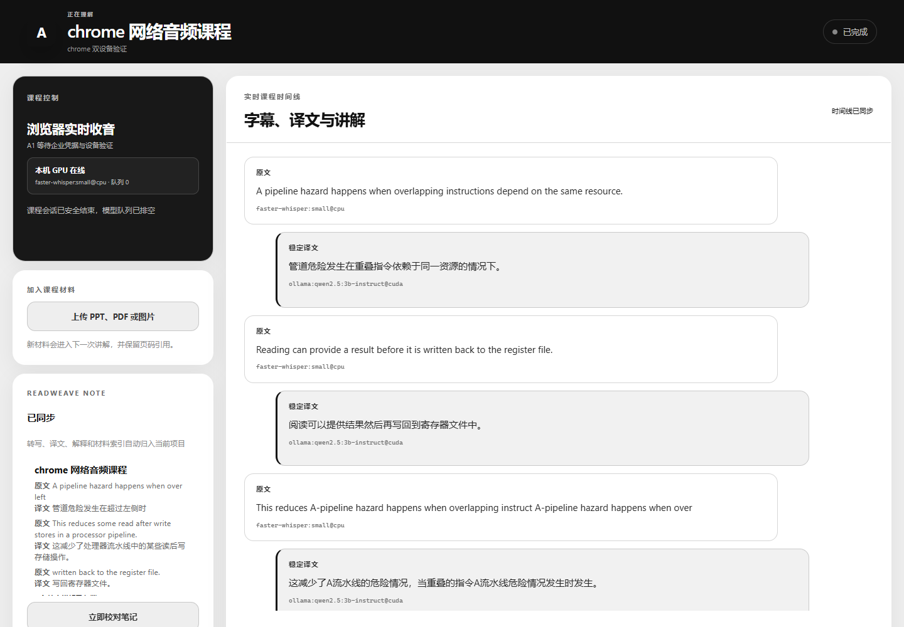
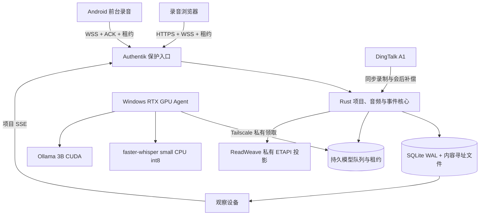

<div align="center">

# AIALRA-LIVE-TRANSLATE

同一课程项目可由多台设备同步查看，唯一录音设备把音频安全送往本机 GPU，持续生成字幕、中文译文、补充讲解和 ReadWeave 笔记

[English](README.en.md) · [部署说明](deploy/README.md) · [隐私边界](docs/PRIVACY_BOUNDARIES.md) · [验证记录](docs/VALIDATION_REPORT.md)

`Public beta` · `Local first` · `RTX CUDA verified` · `Multi-device sync` · `ReadWeave`



图 1　公开合成课程音频经 `faster-whisper:small@cpu` 和 `ollama:qwen2.5:3b-instruct@cuda` 处理后的真实项目页面，ReadWeave 已同步并显示同页预览，运行标识已隐藏，图片元数据已移除

</div>

## 它解决什么问题

听英文课程时，用户不应同时承担听写、翻译、生词查询、课件整理和笔记归档

AIALRA 把这些动作放进同一条课程时间线：

- 同一个 Authentik 用户可在电脑、手机和观察设备上看到一致的项目、会话和处理状态
- 同一项目只有一个有效录音租约，其他设备保持实时观察，租约过期后才允许接管
- 电脑或手机浏览器直接采集麦克风、标签页或系统共享音频
- 浏览器把未确认音频和下一序号放进同一个 IndexedDB 事务，刷新与短时断网后继续补传
- 音频块先持久化再 ACK，Core 重启后从持久块和游标重建 ASR 窗口
- VPS 只负责入口、身份验证、持久队列和事件，RTX GPU Agent 主动领取任务
- 稳定字幕、译文、讲解和人工修订采用追加式事件，旧结果不会被静默覆盖
- PPT、PDF、DOCX、图片和文本进入后续讲解，并保留字幕或页码证据
- ReadWeave 通过私有 ETAPI 接收可重建笔记投影，人工笔记和管理区外内容不会被覆盖
- DingTalk A1 可作为同步录音和会后补偿来源，公开接口尚未证明连续第三方 PCM 能力

本项目不是隐蔽录音工具，真实录音前必须确认已经获得许可，并遵守课程、学校和适用法律要求

## 已验证的运行结构



音频接收、落盘、ACK 和停止控制不等待模型，GPU 离线时任务保持排队，不生成 identity 或 deterministic 占位结果

## 第一次本地运行

前置条件：Windows、Rust 1.95、Node.js 22、pnpm 10、Python 3.12 或 3.13、uv、Ollama 和 NVIDIA CUDA

先准备本地模型：

```powershell
ollama pull qwen2.5:3b-instruct
setx OLLAMA_NUM_PARALLEL 2
```

再启动完整本地链路：

```powershell
./scripts/start-local.ps1
```

重新启动 Ollama 后，脚本会构建网页、启动 Rust Core、模型 Worker 和三通道 GPU Agent，并只打开一个课程工作台页面

首次可观察结果：

1. 勾选“我已获得课程录音许可”
2. 选择麦克风或浏览器标签／系统共享音频
3. 点击“开始理解”，确认红色录音状态和音频 ACK 状态
4. 朗读或播放公开测试材料，等待字幕和译文显示实际 CUDA Provider
5. 点击“停止并保存”，界面会区分“录音已停止”和“模型处理完成”

浏览器实录需要 `localhost` 或 HTTPS 安全环境

## 当前能力

| 能力 | 当前状态 | 证据边界 |
|---|---|---|
| 项目与多端同步 | 可用 | Authentik 稳定用户标识、所有者隔离、项目 SSE 游标恢复、Chrome 与 Edge 双设备观察 |
| 单录音设备 | 可用 | 45 秒项目租约、10 秒续期、第二设备 `409`、过期接管递增代次、旧租约拒绝 |
| 浏览器收音 | 可用 | AudioWorklet、16 kHz 单声道 PCM、序号、ACK、IndexedDB 未确认块恢复 |
| 音频重启恢复 | 可用 | 持久音频块、装配游标、2 至 8 秒窗口、尾部封存、乱序补传和精确重复帧检查 |
| 私有 GPU 链路 | 可用 | VPS 持久队列、60 秒租约、20 秒续租、Tailscale 私有 Gateway、DPAPI 令牌 |
| 实时字幕 | 可用 | `faster-whisper small + CPU int8`，12 线程与高优先级 Worker 通过 30 分钟门禁 |
| 中文翻译与讲解 | 可用 | `qwen2.5:3b-instruct` 本地 Ollama CUDA，翻译与讲解独立领取，结果必须证明 `@cuda` |
| 课程材料 | 可用 | PPTX、PDF、DOCX、图片和文本，复杂 OCR 与 VLM 仍在规划 |
| ReadWeave 笔记 | 可用 | 私有 ETAPI、30 秒批次、同页原文／译文预览、修订、管理标记、冲突恢复副本和用户笔记保护 |
| Android | 短时真机通过 | 前台服务、先落盘、ACK 后删除，90 分钟与锁屏门禁未完成 |
| DingTalk A1 | 控制与补偿链路 | 公开资料未证明第三方连续 PCM 或增量逐字稿能力 |
| 摄像头与自动截屏 | 规划中 | 默认关闭，尚未进入生产路径 |

## 真实门禁结果

测试条件：2026-08-29，Windows，RTX 4080 16 GB，公开合成英语课程音频，`small + CPU int8` ASR 和本地 3B CUDA 模型

| 门禁 | 结果 |
|---|---:|
| 30 分钟 small CPU | 1183 块音频，179 字幕，179 译文，35 讲解卡，缺口、重复、失败和 OOM 均为 0 |
| 30 分钟 p95 | Worker 0.246 秒，ASR 2.739 秒，翻译 1.209 秒，讲解 2.297 秒 |
| 浏览器断网恢复 | Chrome 5、15、60 秒和 Edge 5 秒全部恢复，未确认音频最终清零 |
| 多设备录音租约 | 第二设备 `409`，45 秒后接管，generation 递增，旧租约拒绝 |
| 音频乱序与重传 | 第 2 块先到仍能恢复连续窗口，精确重传不重复持久化 |
| Core 重启 | 不足一个窗口的尾音在重启后恢复，2 块音频只产生 1 条最终字幕 |
| GPU Agent 与私网恢复 | Agent 自动重启，Worker Gateway 中断 30 秒后继续领取任务 |
| ReadWeave 恢复 | 离线 45 秒期间任务排队，恢复后自动补写，冲突为 0 |
| 90 分钟浏览器完整性 | 4573 块、686 字幕和 686 译文，缺口、重复、失败与 OOM 均为 0，故障注入后完成 |
| 90 分钟累计性能 | 外部高 CPU 负载导致 Worker 与 ASR p95 超标，明确判定失败 |
| 30 分钟 small CPU 性能 | 强制数据库门禁通过，冻结为当前默认配置 |

这些数字只描述列出的合成样本和硬件，不代表所有口音、课堂噪声或尚未完成的长时门禁

复现入口见 [验证记录](docs/VALIDATION_REPORT.md) 和 `tools/e2e_smoke.mjs`

## 私有部署

混合部署由 VPS 持久接收音频，本机 GPU Agent 主动领取任务，VPS 不访问家庭公网地址

初始化 Windows DPAPI 令牌并安装登录自启动：

```powershell
./scripts/initialize-gpu-agent-secret.ps1
./scripts/install-gpu-agent.ps1 -GatewayUrl "http://worker-gateway.example.invalid"
```

VPS 只保存令牌 SHA-256 摘要，公开 Nginx 对 `/internal/` 固定拒绝，Worker Gateway 只绑定私有网络接口

生产 Core 只接受反向代理覆盖写入的 Authentik 稳定用户标识；ReadWeave ETAPI 只在私有容器网络开放，浏览器永远不会收到 ETAPI Token

完整部署和回滚边界见 [部署说明](deploy/README.md)

## 验证

```powershell
cargo test --workspace
cargo clippy --workspace --all-targets -- -D warnings
pnpm lint
pnpm typecheck
pnpm test
pnpm build
uv run ruff check workers tools
uv run mypy workers tools
uv run pytest
```

## 数据与安全

- 录音、逐字稿、课件、令牌、私有地址和临时下载链接禁止进入 Git、测试快照和普通日志
- 真实录音必须先记录许可确认，并持续显示录音状态和停止入口
- 本地模式默认关闭云端文本与图片出口
- 原始数据位于独立私有目录，代码回滚不会删除用户会话
- 示例只使用合成内容、保留域名和空凭据

发现安全问题时，请使用 GitHub 的私密安全报告，不要在公开 Issue 附带录音、令牌、真实地址或服务器信息

## 项目目录

- `crates/`：Rust 状态机、事件、持久队列、音频接收和 API
- `workers/`：ASR、翻译、讲解、材料解析和 GPU Agent
- `apps/web/`：黑白单页课程工作台
- `apps/android/`：Android 长时录音客户端
- `apps/dingtalk-miniapp/`：DingTalk A1 控制与前台能力探针
- `deploy/`：VPS、Nginx、Authentik 和私有 Gateway 配置
- `docs/`：决策、研究、隐私、限制、变更和验证记录
- `docs/READWEAVE_INTEGRATION.md`：笔记目录、投影范围、冲突和恢复规则

## 支持与许可

问题和功能建议通过本仓库 Issue 跟踪

本仓库当前没有 `LICENSE` 文件，除适用法律另有规定外，权利人未授予复制、分发、修改或商用许可
