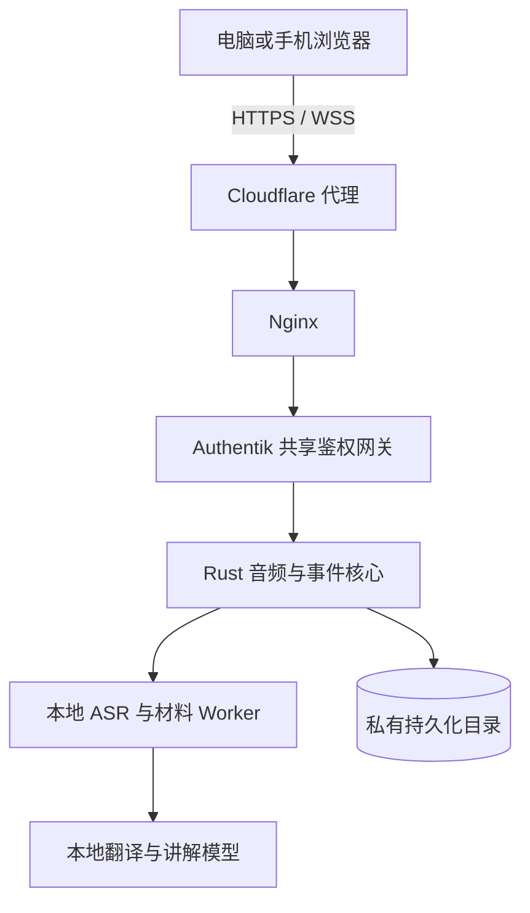

# VPS 部署说明

这套部署把浏览器音频经 HTTPS/WSS 发送到受 Authentik 保护的 AIALRA 主机。Rust 核心先落盘并确认音频，再由 CPU 版 `faster-whisper`、本地 Ollama 和文档 Worker 处理。任何第三方模型出口默认关闭。

## 运行关系

## 首次上线顺序

1. 从 `.env.example` 生成仅存在于 VPS 的环境文件，并填写真实站点主机名。
2. 创建 Cloudflare 代理 DNS 记录；源站只开放现有 Nginx 入口。
3. 构建并启动三个容器，确认核心与 Worker 健康。
4. 拉取体积受控的本地 Ollama 模型。
5. 把站点加入 AIALRA 共享鉴权网关并同步 Authentik 回调。
6. 安装 Nginx 配置、申请证书并验证匿名访问会跳转登录。
7. 使用合成课程验证 SSE、WebSocket、字幕、译文、停止排空和上传材料。

## 必须保留的边界

- 环境文件、Cloudflare 凭据、DingTalk 凭据和 Authentik 管理信息不得进入 Git。
- 数据与模型目录独立于版本目录；回滚代码时不覆盖录音或数据库。
- Nginx 必须覆盖客户端伪造的身份头，并对 WebSocket 使用一小时读写超时。
- 真实录音前必须勾选许可确认，录音期间持续显示红色状态。
- VPS 没有 GPU。默认 `small + CPU int8` 是可运行展示配置，不代表 90 分钟课堂性能已经达标。
- 生产课堂应增加一台 4080 GPU Worker，通过私有出站连接领取已持久化的音频任务；VPS 继续承担入口、ACK、事件和恢复。

## 回滚

部署前备份当前 Nginx 文件、鉴权应用清单和 Compose 环境文件。回滚只切换应用版本和代理配置，不删除数据目录。DNS 记录在验证失败时保留为关闭状态或恢复先前值，避免误删其他站点记录。
