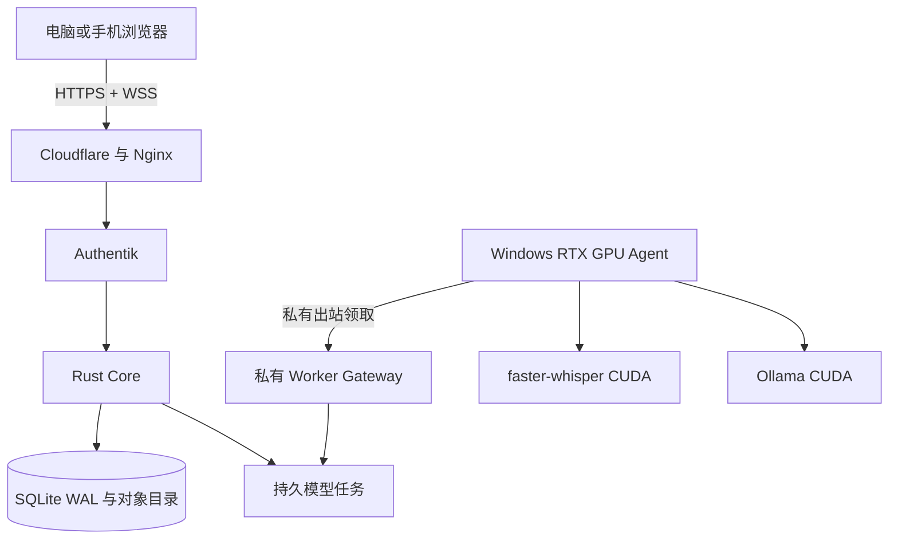

# 私有 GPU 混合部署

这套部署把浏览器音频经 HTTPS/WSS 发送到受 Authentik 保护的服务器，Rust Core 先持久化并 ACK，再由 Windows RTX GPU Agent 主动领取模型任务

服务器不运行默认 CPU ASR 或小型假替代模型，GPU 离线时只安全保存和排队

## 1 运行关系



## 2 服务器准备

1. 从 `.env.example` 生成只存在于服务器的环境文件
2. 设置保留域名以外的真实站点主机名、持久数据目录和 Worker 令牌 SHA-256 摘要
3. 为 Worker Gateway 准备私有网络接口与最小访问策略
4. 构建并启动 Core，确认健康接口和持久目录
5. 把站点加入共享 Authentik 入口，确认匿名请求和伪造身份头都不能绕过登录
6. 安装 Nginx 配置，确认公开 `/internal/` 固定拒绝
7. 使用合成课程执行离线、恢复、Core 重启和真实 Provider 门禁

部署器依赖现有共享 Authentik 与 Nginx 控制面，相关根目录通过 `AIALRA_PLATFORM_ROOT` 显式传入，仓库不保存真实生产目录

## 3 Windows GPU Agent

先初始化一个随机令牌，服务器只保存它的 SHA-256 摘要：

```powershell
./scripts/initialize-gpu-agent-secret.ps1
```

再安装 Agent：

```powershell
./scripts/install-gpu-agent.ps1 -GatewayUrl "http://worker-gateway.example.invalid"
```

安装器优先使用当前用户的任务计划程序，权限不足时退回用户登录启动项

状态与卸载：

```powershell
./scripts/get-gpu-agent-status.ps1
./scripts/uninstall-gpu-agent.ps1
```

## 4 必须保留的边界

- 环境文件、Cloudflare 凭据、DingTalk 凭据、Authentik 管理信息和 Worker 明文令牌不得进入 Git
- 数据目录独立于版本目录，代码回滚不能覆盖录音或数据库
- Core 只映射服务器回环端口，公开站点由 Nginx 与 Authentik保护
- Worker Gateway 只绑定私有接口，公开 Nginx 对 `/internal/` 返回拒绝
- Tailscale 或等价私有网络策略只允许指定 GPU 节点访问 Gateway
- 真实录音前必须记录许可确认，录音期间持续显示红色状态与停止入口
- Provider 不可用时任务保持可重试，不返回 identity、deterministic 或 mock 结果
- 普通日志不记录音频、字幕、课件、令牌、私有地址或临时下载链接

## 5 上线门禁

- GPU 离线：音频 ACK 完整，字幕为 0，任务进入持久队列
- GPU 恢复：任务自动完成，最终事件不重复
- Core 重启：任务与 `processing` 状态保留
- Provider：页面、事件与 Agent 返回的模型和设备一致
- 页面：同一页面完成许可、采集、停止、等待、字幕、译文、材料与讲解
- 性能：先通过 30 分钟，再执行 90 分钟真实收音

## 6 回滚

部署前备份当前 Nginx 文件、鉴权应用清单和 Compose 环境文件

回滚只切换应用版本和代理配置，不删除持久数据目录，也不清理共享容器、证书或其他项目资源
