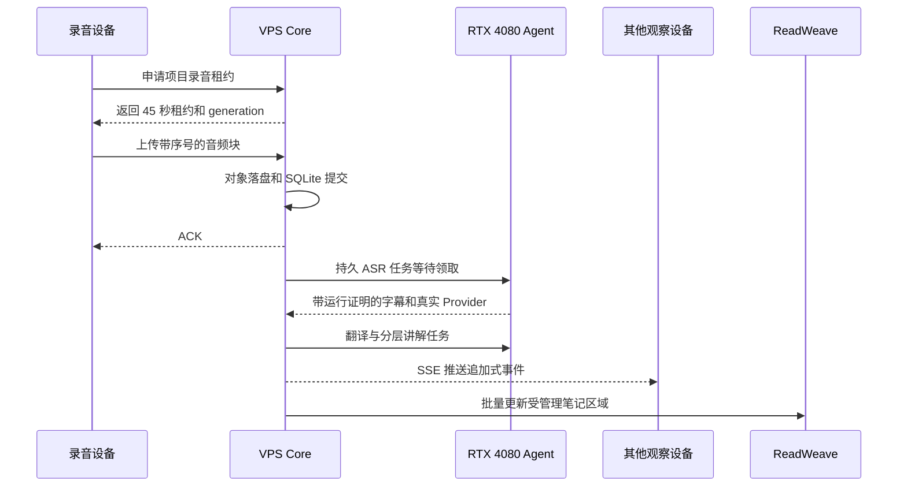

# AIALRA 持续课程工作区心智模型

状态日期：2026-08-31

## 1 一句话理解

AIALRA 不是把麦克风直接接到一个模型，而是先把课程归入长期项目，把每块音频可靠保存，再由本机 RTX 4080 异步生成字幕、译文、讲解和课程总结

服务器是事实源，浏览器和 Android 是采集端，RTX 4080 是可恢复的计算端，ReadWeave 是可以重建的笔记投影

## 2 五个主要组件

| 组件 | 只负责什么 | 不负责什么 |
|---|---|---|
| 浏览器工作区 | 项目树、麦克风测试、录音控制、连续课程文档、多端观察 | 不保存服务端密钥，不生成占位字幕 |
| Android 客户端 | 后台长时录音、本地待确认队列、ACK 后清理、短期配对 | 不承担课程事实源，不直接访问 ReadWeave ETAPI |
| VPS Core | 身份、项目、录音租约、音频落盘、事件、任务队列、SSE | 不在请求线程等待大模型，不主动访问家庭公网地址 |
| 本机 GPU Agent | 主动领取 ASR、翻译、讲解、总结和图片理解任务 | 离线时不伪造结果，不接收其他用户的任意请求 |
| ReadWeave | 展示课程笔记、保留用户笔记、提供逐节点跳转 | 不是转写事实源，不接收原始音频和临时下载地址 |

## 3 一段真实请求如何流动

关键控制点如下：

- 没有许可确认时不能开始真实录音
- 同一项目只有一个有效录音租约，其他设备只能观察
- ACK 只在音频对象和数据库事务都成功后返回
- GPU 离线不会影响音频落盘，任务保留为排队状态
- 只有带任务幂等键、有效租约和运行证明的本机 Provider 才能成为完成结果
- 云端文本和图片出口默认关闭，原始音频不进入云端模型
- ReadWeave 只改写管理标记内的内容，`99 我的笔记` 不被自动覆盖

## 4 为什么采用混合结构

当前结构把工作区、项目、会话和固定笔记节点放在同一棵树中

用户可以移动和归档文件夹与项目，课程会话内部仍保留 `00` 至 `03` 和 `99` 五类稳定节点，这让 AIALRA 和 ReadWeave 可以保持一对一映射

被拒绝的主要替代方案是继续使用一次性录音会话页

该方案开发更快，但刷新后缺少稳定位置，多设备不能独立浏览历史课程，ReadWeave 也只能得到孤立笔记，无法支持长期课程管理

## 5 已有真实证据

### 5.1 当前短测证据

2026-08-31 的运行证明短测经过 HTTPS、WSS、SQLite、私有 Worker Gateway 和 RTX 4080 后，完成 60/60 ACK；正常网络 ACK p95 为 7 毫秒，ASR p95 为 1420 毫秒，翻译 p95 为 1624 毫秒，14B 总结为 16798 毫秒

音频缺口、重复段落和 GPU OOM 均为 0；随后完成的 30 分钟预检同样保持 1782/1782 ACK、134 个连贯段落、134 个译文和 1 份 14B 总结，最新 90 分钟正式门完成 5345/5345 ACK、401 个连贯段落和译文、66 个教学块与 1 份 14B 总结

详细数字见 [验证报告](VALIDATION_REPORT.md)

### 5.2 历史九十分钟运行（不作为当前发布门）

旧运行完成 5328 个音频 ACK、1466 条字幕、1466 条译文和 278 张讲解卡

测试在第 300、1800 和 3600 秒注入 5 秒、15 秒和 60 秒网络中断，最终音频缺口、重复结果、假结果和 GPU OOM 均为 0

ASR、翻译和讲解 p95 分别为 1.284、7.886 和 10.678 秒；最终总结约 291 秒，超过同步和异步预算，因此整轮不能标记为完整通过

### 5.3 GPU 离线恢复

一次正式长测启动时，Ollama 没有运行，Core 仍持续确认并保存 756 个音频块，页面没有生成假字幕

GPU 守护进程修复并恢复后，排队数据形成 208 条字幕、208 条译文、17 张讲解卡和 1 份课程总结，435 个模型任务均只完成 1 次

这条失败链证明音频可靠性与模型可用性已经解耦

## 6 状态边界

### 6.1 已完成

- 持续工作区路由、项目树和设备偏好
- 同用户多设备同步与不同用户隔离
- 项目级单录音租约和过期接管
- 浏览器、Android 与持久音频恢复
- 真实 CUDA ASR、7B 连贯段落翻译与滚动讲解、14B 最终总结、Qwen3-VL 8B 图片理解
- ReadWeave 固定节点、用户文件夹映射、冲突保护和当前标签跳转
- GPU 利用率、显存、功耗、温度、当前模型和队列状态

### 6.2 部分完成

- Android 已有短时真机证据，锁屏和网络切换长测需要持续补充
- 移动浏览器前台可以录音，后台能力受系统限制
- 本地图片理解可用，实时录音期间的大图任务仍需要更严格的可取消调度
- 云端高精度模型有策略边界，但没有独立应用凭据时保持关闭

### 6.3 尚未开始

- 多用户成员权限和项目邀请
- 原生 iOS 后台录音
- 摄像头自动取证和 PPT 自动截图
- 课程数据保留、删除和导出界面

### 6.4 未知

- DingTalk A1 是否存在可供第三方使用的连续 PCM 或增量逐字稿合作接口
- 不同学校、课程和司法辖区的具体录音许可条件

## 7 如何预测故障后的行为

- 如果本机 GPU 关机，录音设备仍收到持久化后的 ACK，页面显示等待本机 GPU，恢复后从旧任务继续
- 如果录音设备断网，未确认块保留在本地，租约未被接管时可续回并按原序号补传
- 如果第二台设备在租约有效期内请求录音，它得到 `409`，但仍能查看同一项目的实时内容
- 如果 ReadWeave 停止，字幕和翻译继续产生，连接器任务排队，恢复后按幂等键补写
- 如果管理标记被人工删除，AIALRA 停止覆盖原笔记并创建恢复笔记

## 8 仍会改变结论的条件

- 后续 6 小时或 24 小时门禁出现音频缺口、重复字幕、OOM 或延迟超标时，当前模型组合不能标为长时稳定
- Android 30 分钟后台测试出现系统杀进程或待确认音频增长时，浏览器和原生客户端的职责需要重新划分
- Qwen3-VL 在更多公式、图表和扫描件样本上明显低于要求时，应保持本地初筛，再对用户逐项授权的材料使用高精度云端模型
- ReadWeave 冲突恢复无法稳定保留人工内容时，应暂停自动覆盖并降级为只追加恢复笔记

## 9 自测问题

1. GPU 离线一分钟时，为什么录音仍应继续，而页面不能立刻显示字幕
2. 第二台设备何时可以接管录音，接管后旧设备上传为什么必须被拒绝
3. ReadWeave 笔记损坏时，哪个系统仍然保存课程事实，如何重新生成投影
