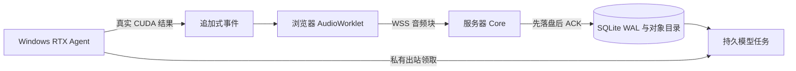

# 浏览器与私有 GPU 上线方案

状态日期：2026-08-27

## 1 冻结结构

电脑和手机继续使用同一个 HTTPS 页面

服务器承担 Authentik 鉴权、音频持久化、ACK、SQLite 模型队列、追加式事件和恢复，本机 RTX GPU Agent 主动领取任务

VPS CPU ASR 与小型 Ollama 不再是生产主路径，GPU 离线时不产生占位结果

## 2 数据流

浏览器把未确认块保存到 IndexedDB，刷新或短时断网后继续重发

## 3 网络与鉴权

- 公开入口只暴露 HTTPS/WSS，并由 Authentik 保护
- Nginx 覆盖客户端身份头，伪造身份头不能绕过登录
- 公开 `/internal/` 固定拒绝
- Worker Gateway 只绑定私有接口
- 私有网络规则只允许指定 GPU 节点访问 Gateway
- 应用层使用独立 Worker 令牌，服务器保存摘要，Windows 使用 DPAPI 保存明文

## 4 Worker 行为

- 20 秒长轮询，10 秒心跳，60 秒任务租约，每 20 秒续租
- 断网按 `1、2、4、8、16、30` 秒退避
- ASR 最高优先，翻译次之，讲解和材料任务可延后
- 租约过期任务重新排队，完成事务同时写入事件与关闭任务
- OOM 或 Provider 不可用时返回可重试失败，不生成 fake 结果

## 5 上线顺序

1. 部署数据库迁移与持久队列
2. 安装 Windows GPU Agent 与登录自启动
3. 打通私有 Gateway 并完成离线、恢复与 Core 重启
4. 切换生产会话到真实 GPU 队列
5. 停用 VPS CPU Worker 与默认 Ollama
6. 发布黑白单页并验证桌面、暗色和窄屏
7. 使用公开合成音频生成真实 Provider 截图
8. 完成 GitHub 安全门禁后再公开仓库

## 6 已通过与待通过

已通过：

- 21／21 音频 ACK
- GPU 离线时 0 假字幕与持久排队
- GPU 恢复后任务自动完成且重复字幕为 0
- Core 重启后任务和 `processing` 状态保留
- 本机与私有远程 RTX 真实闭环
- Authentik、WSS、公开内部接口拒绝与单页黑白界面

待通过：

- 30 分钟连续模型稳定性
- 90 分钟 Chrome、Edge 与 Android 前台收音
- 登录用户真实麦克风最终人工闭环
- OCR、VLM、摄像头与 DingTalk A1 会后对账

完整数字见 [验证报告](VALIDATION_REPORT.md)，运维边界见 [部署说明](../deploy/README.md)
