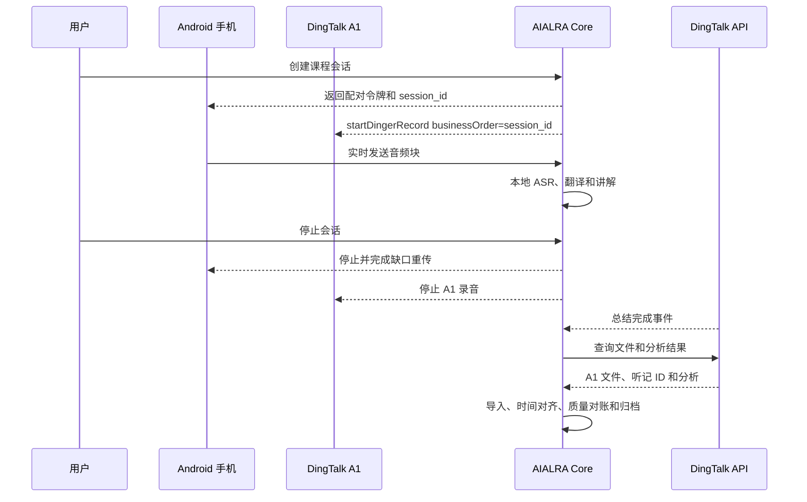
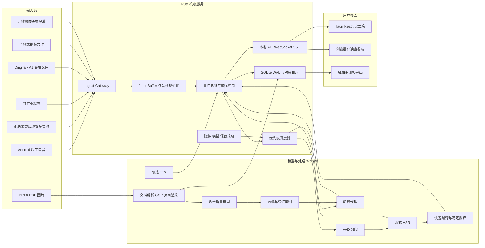

# AIALRA-LIVE-TRANSLATE 项目初始研究实施报告

版本：`0.1.0-planning-baseline`

日期：2026-08-24

面向读者：项目所有者、Codex、后续工程代理、模型与客户端开发者

项目一句话定位：**AIALRA-LIVE-TRANSLATE 是一个本地优先的多模态实时学习副驾，把课程现场的声音、字幕、译文、幻灯片、图片和周期讲解组织到同一条可回放时间线中，让用户在听课时尽量不需要手动记笔记**

## 1 执行结论

项目整体可行，用户现有的 Intel Core i9-13900K、NVIDIA RTX 4080 16 GB 和 64 GB 内存足以支撑单用户本地实时语音识别、双语字幕、周期文本讲解和按需图片理解；可行性成立的前提是把任务拆成不同优先级队列，让实时字幕长期占有最高优先级，讲解、视觉理解和语音合成只使用剩余资源

钉钉 A1 适合成为录音控制器、会后原始音频来源和官方转写对账来源；公开接口已经覆盖启动录音、设备状态、录音文件、分析结果和完成事件，但尚未发现第三方持续获取 A1 实时 PCM 音频或实时逐字稿事件的公开接口，因此 A1 直连实时流不能成为首版唯一输入路径 [1, 2, 3, 4, 5, 6, 7]

首版可靠录音链路应采用 Android 原生前台服务，手机持续采集麦克风、按短块编码为 Opus、在本地保留滚动缓存，再通过加密 WebSocket 发送到电脑；钉钉小程序可以用于前台短时原型和 A1 控制，但官方录音管理器会在页面不可见时自动停止，无法独立承担锁屏或切换应用后的长课程录音 [2]、[8]、[9]

本项目不应重新实现一套普通会议纪要平台；现有 BabbleDeck 已经具备浏览器录音、WebSocket/SSE、Soniox、音频分块恢复、事件持久化、术语表、导出、LiveKit、Tauri/Capacitor 和生产运维能力，AIALRA-LIVE-TRANSLATE 应复用其协议和测试经验，把新增价值集中在本地推理、课程术语解释、幻灯片对齐、Android 长时采集、A1 适配和多模态课程记忆 [10, 11, 12]

推荐的最小可行产品不包含自动摄像头识别、连续语音播报或多人实时分离；首个可发布闭环只需要完成以下能力

- Android 或电脑麦克风稳定录音 60–90 分钟
- 电脑本地实时生成原文和译文，并区分临时字幕与稳定片段
- 每隔一段内容或发生主题变化时自动生成摘要、缺漏补充和生僻词一句话解释
- 用户可以在课程中随时上传 PPTX、PDF 或图片，系统在下一次讲解时引用相关页和相关字幕片段
- 会话结束后可以按时间线回放、搜索、校正和导出
- 全流程默认保存在本机，云端模型和远端存储均为显式选择

## 2 研究证据边界

### 2.1 本次已经核验的材料

本次调查使用了以下事实来源

- AIALRA 的人类可读技术写作 Skill 和文档协作规范，用于决定报告结构、术语解释、证据边界和 Codex 交付格式 [10]、[13]
- 文件库中的 `BabbleDeck_Full_Development_Package.md`，用于识别已经完成的实时音频、事件、恢复、数据库、测试和代理执行设计 [11]
- GitHub 中当前 BabbleDeck 的 `PROJECT_MEMORY.md` 与 README，用于确认该项目已经从文档原型发展为具备生产部署和完整验证的线上平台 [12]
- 钉钉开放平台 A1、RecorderManager 和 WebSocket 文档，用于区分已公开能力与未公开能力 [1, 2, 3, 4, 5, 6, 7, 8, 9]
- ASR、VAD、说话人分离、文档解析、本地大模型和多模态模型的一手项目或厂商文档 [14, 15, 16, 17, 18, 19, 20, 21, 22, 23, 24, 25, 26, 27, 28, 29, 30, 31]
- 会议助手、录音硬件和现场翻译竞品的官方产品页 [32, 33, 34, 35, 36, 37, 38, 39, 40, 41, 42, 43, 44, 45, 46, 47, 48, 49]
- 加州录音法规与 USC 课程录音政策 [50]、[51]

### 2.2 本次尚未核验的材料

当前对话没有获得用户本机 `AIALRA-LIVE-TRANSLATE` 的文件树、`PROJECT_STATE.md`、未提交修改、现有技术栈、测试记录和真实设备日志

以下结论必须由 Codex 在本地仓库和真机中继续核验

- 本地项目是否已经存在 Rust 核心、Python Worker、网页界面或旧版协议
- DingTalk A1 的当前固件和当前账号是否开放实时字幕导出、局域网访问或未公开合作接口
- A1 的 `businessOrder` 是否能稳定映射到文件列表、听记 ID 和总结事件
- 钉钉小程序在目标 Android 设备上的录音帧大小、编码格式、前后台行为和网络抖动
- RTX 4080 上各候选 ASR、翻译模型、文本模型和视觉模型的真实延迟与显存组合
- 课程教室的距离、混响、教师麦克风、背景噪声和中英混说对识别质量的影响

### 2.3 结论置信度标记

本文采用 3 类标记

- **已证实**：由官方文档、现有仓库或可复现材料直接支持
- **工程推断**：根据已证实接口和成熟架构推导，仍需要本地测试确定参数
- **待验证**：缺少公开接口或缺少真机证据，不能写入首版关键路径

## 3 产品使用目标

### 3.1 目标用户

首要用户是需要在英文或中英混合课程中同时理解内容、查看译文并保留学习资料的个人学生

次要用户包括

- 参加技术讲座、学术会议和研讨会的研究者
- 需要跨语言培训和现场知识补充的工程师
- 需要在私有环境处理敏感内容的小型团队
- 需要把声音、幻灯片和解释整理为可检索学习资料的自学用户

### 3.2 用户希望解决的问题

课程现场的主要困难并非只有“听不懂某一句话”，还包括以下连续负担

- 用户需要在听老师、读 PPT、看译文和手写笔记之间频繁切换注意力
- 实时转写会出现临时误识别，用户很难判断哪些文字已经稳定
- 直译往往缺少课程背景、缩写展开、专有名词和前置知识
- 普通会后总结来得太晚，无法在课程仍在继续时帮助理解下一段
- 用户临时拍摄或上传的图片通常与逐字稿分离，之后很难恢复当时的语境
- 长课程中网络、手机锁屏、GPU 资源竞争或供应商错误会造成不可恢复的缺口

### 3.3 标准课程工作流

- 第一步：用户在电脑创建课程会话

  - 选择源语言模式，例如英语、中文或中英混合
  - 选择目标语言，例如简体中文
  - 选择录音源，例如 Android 手机、电脑麦克风、钉钉 A1 或文件回放
  - 选择隐私策略，例如仅本地、允许文本云增强或允许选定图片云增强
  - 确认已经获得必要的录音许可

- 第二步：手机通过二维码与电脑配对

  - Android 客户端开始前台录音服务
  - 本地滚动缓存立即工作
  - 音频短块通过加密连接发送到电脑
  - 用户界面显示麦克风输入、延迟、丢包、缓存和录音状态

- 第三步：电脑持续显示双语字幕

  - 临时原文和临时译文使用较弱视觉权重
  - 稳定片段进入正式时间线
  - 后续更正以新版本追加，不静默覆盖历史
  - 低置信度、专有名词和疑似缩写获得可见标记

- 第四步：解释代理按触发条件工作

  - 达到时间阈值、文本量阈值、主题切换、幻灯片切换或未知术语密度阈值时触发
  - 输出本段摘要、缺失背景、关键术语一句话解释、疑似识别错误和复习问题
  - 每一条解释引用字幕片段 ID 和幻灯片页 ID
  - 解释生成失败不会阻塞实时字幕

- 第五步：用户随时插入多模态材料

  - 上传 PPTX、PDF、图片或截图
  - 系统提取文本、页面结构、图片和标题
  - 新材料立即进入索引，并回填与最近字幕片段的关联
  - 下一次自动讲解同时考虑最近字幕、课程滚动记忆和最相关页面

- 第六步：会话结束后形成学习资料

  - 用户查看带时间戳的原文、译文、解释和页面
  - 用户校正识别或翻译，并保留修订历史
  - 系统生成课程摘要、术语表、知识点清单和待复习问题
  - 用户导出 Markdown、HTML、JSON、SRT、VTT 和可选音频包

### 3.4 非目标

首版明确排除以下目标

- 不追求替代专业同声传译员
- 不承诺任何课程中达到固定识别准确率
- 不把自动生成的解释视为课程事实来源
- 不默认把录音、逐字稿或幻灯片上传到第三方
- 不在未验证 A1 实时接口前依赖 A1 作为唯一实时音频源
- 不在字幕链路稳定前加入持续语音播报
- 不在单讲者课程闭环完成前强制实现多人实时说话人分离

## 4 可行性分析

### 4.1 能力矩阵

<div align="center">

表 4.1 关键能力可行性

| 能力 | 可行性 | 证据状态 | 主要条件 | 首版决定 |
| --- | --- | --- | --- | --- |
| Android 长时录音并串流到电脑 | 高 | 工程推断，成熟平台能力 | 原生前台服务、本地缓存、重连协议 | 主链路 |
| 电脑麦克风直接录音 | 高 | 已证实，BabbleDeck 已有实现 | 浏览器或桌面音频权限 | 备用主链路 |
| 钉钉小程序逐帧录音并 WebSocket 发送 | 中 | 已证实接口，真机待测 | 页面保持可见、单连接限制、帧格式适配 | 原型支线 |
| 钉钉小程序锁屏或切应用后继续长时录音 | 低 | 官方文档明确页面不可见时停止 | 需要原生容器或产品侧特殊能力 | 不作为主链路 |
| A1 启停、状态和业务订单关联 | 高 | 已证实 | 权限、设备绑定、企业应用配置 | A1 适配器一期 |
| A1 会后录音文件和分析结果导入 | 高 | 已证实 | 听记 ID、文件权限、回调或轮询 | A1 适配器一期 |
| A1 持续实时 PCM 或实时逐字稿输出 | 未知 | 未见公开接口 | 需要厂商确认、抓包或合作接口 | 独立探针，不阻塞 MVP |
| RTX 4080 本地实时 ASR | 高 | 候选模型已支持本地和流式 | 真实课程基准、量化和队列调度 | MVP 必须 |
| 本地双语翻译 | 高 | 多种模型可用 | 质量基准、术语约束、修订模型 | MVP 必须 |
| 周期摘要和术语解释 | 高 | 文本模型能力成熟 | 滚动上下文、结构化输出、证据引用 | MVP 必须 |
| PPTX、PDF、图片导入 | 高 | Docling、python-pptx 和 VLM 可用 | 统一资产模型、页面渲染和索引 | MVP 必须 |
| 自动摄像头提取 PPT | 中 | 视觉和变化检测可行 | 视角、反光、遮挡、功耗和隐私 | 后续阶段 |
| 实时语音合成翻译 | 中 | 多种本地 TTS 可用 | 不能抢占字幕 GPU、耳机反馈控制 | 后续阶段 |

</div>

### 4.2 硬件可行性

根据用户本次提供的数据，目标机器包含 Intel Core i9-13900K、NVIDIA RTX 4080 16 GB 和 64 GB 内存

CPU 适合承担以下任务

- 音频解码、重采样、回声和电平分析
- Silero VAD 或其他轻量语音活动检测
- WebSocket、事件排序、SQLite 和文件写入
- PPTX 解包、文档解析、OCR 前后处理和索引
- 在 GPU 忙碌时执行小型后处理或降级翻译

GPU 适合承担以下任务

- 常驻一个实时 ASR 模型
- 在字幕队列空闲时运行 4B–9B 量化文本模型
- 按需加载 2B–4B 视觉语言模型处理新页面
- 在低优先级队列中运行 TTS

64 GB 内存适合承担模型缓存、页面渲染、课程滚动上下文和本地索引；实际可同时常驻的模型组合必须由显存压力测试决定，报告不把模型参数量直接等同于固定显存占用

### 4.3 带宽存储估算

若手机使用单声道 Opus，目标码率设为 24–32 kbit/s

$$
24{,}000\ \text{bit/s} \div 8 \times 3{,}600\ \text{s} = 10.8\ \text{MB/h}
$$

$$
32{,}000\ \text{bit/s} \div 8 \times 3{,}600\ \text{s} = 14.4\ \text{MB/h}
$$

一节 90 分钟课程的压缩音频约为 16.2–21.6 MB，不含协议开销

若临时使用 16 kHz、16 bit、单声道 PCM

$$
16{,}000 \times 16 \times 1 \div 8 \times 3{,}600 = 115.2\ \text{MB/h}
$$

90 分钟 PCM 约为 172.8 MB，因此实时链路可以短时使用 PCM，长期本地备份应优先保存 Opus 或 FLAC；原始音频是否保留由会话策略控制

### 4.4 性能目标

以下数值是工程目标，不是已经完成的性能承诺

<div align="center">

表 4.2 首版性能目标

| 指标 | 目标 | 测量方法 |
| --- | ---: | --- |
| 局域网音频块到达延迟 p95 | 小于 250 ms | 手机单调时钟与服务器校准后的块时间戳 |
| 首个临时字幕 p95 | 小于或等于 1.5 s | 从音频采集到 UI 首次显示 |
| 停顿后的稳定片段 p95 | 小于或等于 2.5 s | 从检测到语义停顿到 `segment.finalized` |
| 稳定片段译文更新时间 p95 | 小于或等于 1 s | 从稳定原文到稳定译文 |
| 双语字幕端到端 p95 | 小于或等于 3 s | 采集时间戳到最终 UI 更新时间 |
| 自动讲解首卡片 | 触发后 10–20 s 内 | 调度器触发到第一张结构化卡片 |
| 已确认音频块丢失 | 0 | 服务器 ACK 与手机本地日志对账 |
| 60–90 分钟会话 GPU OOM | 0 | 长时真实录音压力测试 |
| 用户上传材料进入下一次讲解 | 100% 可追踪 | 讲解结果含资产页 ID 和字幕片段 ID |

</div>

### 4.5 总体可行性结论

技术风险不在“模型能否生成文字”，主要集中在以下边界

- A1 是否开放可用的实时流
- Android 长时录音在锁屏、网络切换和省电策略下是否稳定
- 多模型争抢 16 GB 显存时能否保持字幕延迟
- 解释代理能否明确引用证据并避免把推测写成课程事实
- 图片、幻灯片和字幕能否稳定对齐到同一时间线

这些风险均可以通过降级路径和门禁测试隔离，因此不阻止项目启动

## 5 市场竞争分析

### 5.1 市场现状

实时录音、转写和会后总结已经是成熟且拥挤的产品类别

硬件录音设备已经提供一键录音、多语言转写、说话人标签、模板总结和移动端同步；DingTalk A1、PLAUD Note Pro 和 Notta Memo 均覆盖这一范围 [32, 33, 34, 35]

云端会议助手已经提供实时字幕、会后总结、行动项、跨应用捕获和团队知识检索；Otter、Granola、Krisp 和 Fireflies 代表了这一类别 [36, 37, 38, 39, 40, 41]

现场翻译平台已经提供二维码加入、多语言字幕、语音翻译、词汇表和企业部署；Wordly、KUDO、Interprefy 和 Soniox 覆盖这一范围 [42, 43, 44, 45, 46, 47, 48, 49]

因此本项目不能仅以“实时转写加总结”作为差异化卖点

### 5.2 竞品能力矩阵

<div align="center">

表 5.1 竞品能力对比

| 产品或类别 | 现场录音 | 实时字幕 | 实时翻译 | 会后总结 | 幻灯片或图片 | 课程式即时解释 | 本地或自托管 | 开放事件与可编程性 |
| --- | --- | --- | --- | --- | --- | --- | --- | --- |
| DingTalk A1 | 强 | 强 | 产品侧支持 | 强 | 产品侧图文总结 | 未见公开课程解释工作流 | 设备侧能力加云服务 | A1 控制与会后数据接口较明确，实时流未证实 |
| PLAUD Note Pro | 强 | 产品版本相关 | 多语言处理 | 强 | 未见完整课程时间线证据 | 未见公开证据 | 主要依赖厂商服务 | 以产品工作流为主 |
| Notta Memo 或 Notta | 强 | 强 | 强 | 强 | 支持可视化产物 | 未见课程知识补充闭环 | 主要云服务 | 有平台集成，核心受厂商控制 |
| 讯飞听见 | 强 | 强 | 强 | 强 | 支持边录边拍照和标记 | 以转写、翻译和总结为主 | 客户端加云服务 | 产品接口边界需另行调查 |
| Otter | 线上和移动端 | 强 | 有限语种或版本相关 | 强 | 自动抓取线上会议幻灯片 | AI Chat 可问答，但非本地课程代理 | 云服务 | 集成丰富，内部事件不可由用户完全控制 |
| Granola | 设备音频 | 转写用于笔记 | 非核心卖点 | 强 | 用户笔记驱动 | 以会议笔记增强为主 | 设备捕获，服务处理策略由厂商控制 | 产品集成 |
| Krisp | 跨应用和现场 | 强 | 多语言转写 | 强 | 非核心卖点 | 以会议纪要为主 | 支持离线场景的产品能力，闭源 | 产品集成 |
| Fireflies | 线上会议 | 强 | 多语言处理 | 强 | 非核心卖点 | 以会议搜索与行动项为主 | 云服务 | API 和集成较多 |
| Wordly、KUDO、Interprefy | 现场和线上 | 强 | 很强 | 有 | 非课程重点 | 术语定制强，课程知识解释弱 | 企业服务 | 平台接口和企业集成 |
| Meetily、Vexa、screenpipe、WhisperLiveKit | 依项目而定 | 强 | 依模型而定 | 可扩展 | screenpipe 具备屏幕时间线 | 需要自行开发 | 强 | 强 |
| AIALRA-LIVE-TRANSLATE 目标 | 手机、电脑、A1 和后续摄像头 | 强 | 强 | 强 | 用户插入与自动对齐 | 核心能力 | 默认本地 | 事件溯源、适配器和 Agent 接口全部开放 |

</div>

注：表中“未见公开证据”只表示本次调查没有找到能够支持该能力的官方材料，不等于产品绝对不具备该能力

### 5.3 可占据的产品空缺

本项目的差异化来自以下能力组合

- **课程实时理解**：输出不止是会议摘要，还包括生僻词、缩写、前置知识、疑似漏听和快速复习问题
- **多模态时间线**：用户在课程中插入的 PPT、截图和照片进入下一次讲解，并永久保留与字幕片段的对应关系
- **本地优先**：录音、逐字稿、幻灯片和模型运行默认留在用户机器
- **可修订事件模型**：临时字幕、稳定字幕、译文、纠正和解释均可回放和审计
- **多来源适配**：Android、电脑麦克风、DingTalk A1、文件、屏幕和摄像头可以共享统一协议
- **开发者可控**：模型、提示词、术语表、触发器、数据保留和云端策略均可替换
- **与现有 AIALRA 生态衔接**：后续可以把课程资料写入 Trilium、搜索平台或其他 Agent 工作流

### 5.4 目标市场顺序

第一阶段目标是单用户学习工具，用户本人就是最早的高频测试者

第二阶段目标是国际学生、双语技术课程参与者和研究者

第三阶段目标是需要私有部署的培训团队、实验室和小型企业

企业现场翻译和大型会议不应成为早期市场；该市场已经存在成熟供应商，需要更高的可靠性、合规、服务支持和语言覆盖

### 5.5 商业模式假设

以下模式可以并存，但在产品验证前不应锁定

- 本地核心免费或开源，用户自行下载模型
- 云增强按量收费，只对用户选择的文本或图片调用 DeepSeek、Soniox 或其他供应商
- 高级同步、跨设备备份、团队空间和集中策略作为订阅能力
- 企业私有部署、模型调优和设备接入作为服务收入
- 第三方模型和硬件适配器作为插件生态

### 5.6 市场验证指标

首轮验证不需要大规模用户，重点观察真实课程中的行为

- 用户是否能够在 60 秒内创建会话并开始录音
- 用户在课程中查看字幕、译文和讲解的次数
- 自动解释中被用户展开、固定或复制的比例
- 用户上传材料后，讲解引用相关页面的成功率
- 课程结束后用户回放、搜索和导出的频率
- 用户手动纠正的 ASR、翻译和解释类型
- 用户愿意保留本地模型还是愿意为云增强付费
- 用户是否因为录音许可、耗电或设备携带而放弃使用

## 6 DingTalk A1 音频接入路线

### 6.1 已公开的 A1 能力

钉钉开放平台已经公开以下可用于 AIALRA 的能力

- `startDingerRecord`：控制 A1 开始录音，并允许传入自定义 `businessOrder`，该字段适合写入 AIALRA 会话 ID [1]
- `getDingerDeviceStatus`：查询设备当前状态，适合在 UI 中显示设备是否在线、是否正在录音和是否可用 [7]
- 指定设备音频文件列表：按设备分页查询录音文件，用于会后发现新文件 [4]
- 根据听记 ID 获取 A1 音频文件：把钉钉听记记录映射到具体音频资源 [3]
- A1 小助理分析查询：获取官方分析或总结结果，用于对账和补充 [5]
- A1 小助理总结完成事件：在分析完成后通知应用，避免持续高频轮询 [6]

这些能力足以实现“控制录音 → 等待结束 → 获取文件 → 导入本地 → 获取官方分析 → 与本地结果对账”的完整会后闭环

### 6.2 尚未公开证实的 A1 能力

本次调查没有找到以下公开接口

- 第三方持续订阅 A1 原始 PCM 音频流
- 第三方持续订阅 A1 实时逐字稿 token 或稳定片段事件
- 第三方从 A1 直接获取低延迟局域网音频
- A1 在录音过程中持续回调文件增量或音频分块

钉钉产品侧具备实时转写和翻译，不代表开放平台自动提供同等粒度的数据接口

工程结论：A1 实时能力必须通过独立探针验证；在验证成功前，实时字幕由 Android 或电脑麦克风产生，A1 同时录制高质量备份并在会后导入

### 6.3 钉钉小程序录音路线

钉钉 `RecorderManager.onFrameRecorded` 可以接收分帧录音数据，帧以 Base64 等形式交给小程序；`sendSocketMessage` 可以在建立 WebSocket 后发送数据 [2]、[9]

这一组合可以快速制作原型

```text
DingTalk Mini App
  ↓ RecorderManager.onFrameRecorded
Frame Adapter
  ↓ Base64 decode / format normalize
Single WebSocket
  ↓ framed audio messages
AIALRA Ingest Gateway
```

关键边界如下

- 官方文档说明录音管理器在页面不可见时会自动停止 [8]
- 小程序 WebSocket 连接数量受到限制，需要让音频、控制、ACK 和心跳复用同一连接
- 音频帧格式、帧时长、最大消息和 Base64 开销需要真机测量
- 小程序升级、手机省电策略和钉钉版本可能影响长时稳定性

工程结论：钉钉小程序适合 5–15 分钟的能力验证、A1 控制和前台短时录音；不适合作为 60–90 分钟课程的唯一生产录音端

### 6.4 Android 原生主链路

推荐使用 Kotlin 原生应用实现长期可靠录音

运行组件

- `ForegroundService`：在录音期间保持明确的系统通知和前台服务状态
- `AudioRecord`：以固定采样率和单声道采集 PCM
- `OpusEncoder`：把音频编码为小块，降低带宽和存储
- `LocalRingBuffer`：在断网时保留最近音频块
- `ReliableStreamClient`：通过 WSS 发送、接收 ACK、重发缺口和恢复会话
- `SessionController`：处理二维码配对、开始、暂停、停止和隐私状态
- `DeviceDiagnostics`：记录输入电平、温度、电量、网络类型和丢包

Android 客户端必须把“本地已经持久化”和“服务器已经确认”分开记录；服务器 ACK 之前不能删除本地块

### 6.5 A1 Android 双录音模式

推荐提供 `dual_capture` 会话模式



该模式的价值

- Android 提供实时流
- A1 提供独立高质量录音和厂商结果
- 任一设备失败时仍有另一条证据链
- 会后可以比较识别差异，积累真实课程基准集

### 6.6 A1 能力探针

Codex 应建立独立 `a1-probe` 工具，不把实验代码直接耦合到核心服务

探针需要验证

- 设备枚举和权限错误
- 开始、暂停、停止和状态查询
- `businessOrder` 的最大长度、字符限制和幂等行为
- 录音结束后文件出现延迟
- 文件列表、听记 ID、音频文件和总结事件之间的映射
- 音频 URL 的有效期、下载鉴权、重试和校验和
- 同一设备连续多场录音是否出现重复或漏项
- 官方分析结果的数据结构和版本变化
- 是否存在实时数据字段、回调或企业白名单能力

探针报告必须把网络响应中的敏感令牌和音频 URL 脱敏

## 7 推荐系统架构

### 7.1 架构原则

项目继续采用 AIALRA 已经形成的不可变原则

- 片段是主时间线，翻译、音频、解释和资产关联是派生产物
- 每一次修订追加新版本，不覆盖旧版本
- 控制面与数据面分离
- Rust 承担核心状态机、协议、调度和持久化
- Python 只承担模型 Worker、数据处理和研究性适配
- TypeScript 和 Kotlin 负责界面与设备端
- 默认本地执行，云端只作为可选增强
- 任何输入源都通过统一 Source Adapter 接入
- 实时结果和稳定结果使用不同事件类型
- 原始事件保留到可配置的留存边界，导出内容来自稳定视图

### 7.2 总体架构



### 7.3 模块化单体

首版采用模块化单体，不引入 Kafka、分布式数据库或复杂微服务

推荐 Rust Workspace

```text
AIALRA-LIVE-TRANSLATE/
  apps/
    desktop/                 Tauri 桌面应用
    android/                 Kotlin 原生录音端
    dingtalk-miniapp/        钉钉小程序探针与控制端
  crates/
    core-domain/             会话、片段、修订、资产和策略模型
    event-protocol/          版本化事件与传输消息
    ingest-gateway/          音频源连接、ACK、重连和限流
    audio-pipeline/          缓冲、重采样、分块和质量指标
    scheduler/               GPU 与 CPU 优先级调度
    event-store/             SQLite WAL、迁移、投影视图
    asset-store/             内容寻址对象目录和校验
    provider-sdk/            ASR、翻译、LLM、VLM、TTS 接口
    local-api/               HTTP、WebSocket、SSE 和鉴权
    export-engine/           Markdown、HTML、JSON、SRT、VTT
    privacy-policy/          云端路由、留存、脱敏和许可记录
  workers/
    speech-worker/           Python ASR、VAD、说话人处理
    language-worker/         Python 翻译、解释和嵌入
    vision-worker/           Python 文档、OCR 和 VLM
  packages/
    web-ui/                  React 组件和状态管理
    protocol-types/          从协议生成的 TypeScript 类型
  schemas/
    events/                  JSON Schema 或 Protobuf 定义
    config/                  配置 Schema
  benchmarks/
    audio-fixtures/
    asr/
    translation/
    multimodal/
  docs/
    adr/
    audits/
    architecture/
    research/
    progress/
    test-runs/
  data/
    .gitkeep
```

若本地仓库已经有成熟结构，Codex 应保留现状并逐步建立等价边界，不能为了符合本报告而无理由重写

### 7.4 核心 Worker 通信

Rust 核心和 Python Worker 之间使用版本化、本机优先的协议

推荐顺序

1. Unix Domain Socket 或 Windows Named Pipe 上的 gRPC
2. 本机 TCP gRPC，绑定 `127.0.0.1`
3. 研究性进程可以临时使用标准输入输出 JSONL，但不能作为长期实时协议

协议必须支持

- Worker 能力发现和模型版本
- 会话启动与关闭
- 音频块流
- 临时结果和稳定结果
- 心跳、超时、取消和背压
- 显存不足、模型未加载和队列过长错误
- 运行指标和相关 ID

### 7.5 控制数据平面

控制面负责

- 创建和关闭会话
- 选择输入源和语言
- 选择模型档位
- 配置云端和保留策略
- 管理术语表、课程资料和权限
- 查看 Worker、GPU 和设备状态

数据面负责

- 音频帧、片段、字幕和译文
- 图片和页面提取产物
- 模型调用、解释卡片和修订
- ACK、重连、丢包和回放

控制请求不能与大音频帧共享无限制队列；任何模型拥塞都不能阻止停止录音、暂停或落盘

### 7.6 本地部署模式

#### 7.6.1 模式 A：同一台电脑

手机和电脑位于同一 Wi-Fi，电脑运行全部服务

- 最低部署复杂度
- 最低延迟
- 适合课程现场
- 需要 Windows 防火墙和局域网配对配置

#### 7.6.2 模式 B：家中 GPU 服务器

手机通过 Tailscale、WireGuard 或受控公网 WSS 连接家中电脑

- 现场手机只负责录音
- 家中 RTX 4080 运行模型
- 依赖上行网络和家中机器在线
- 必须保留手机本地缓存

#### 7.6.3 模式 C：无状态中继

VPS 只中继端到端加密音频和事件，不保存明文

- 解决 NAT 和网络可达性
- 不承担模型推理
- 需要明确的密钥轮换和流量限制

#### 7.6.4 模式 D：可选云增强

本地核心把稳定文本或用户选定图片发送给 DeepSeek、Soniox 或其他供应商

- 默认关闭
- 每个会话单独授权
- 发送前显示数据类型
- 记录供应商、模型、时间、哈希和成本

### 7.7 BabbleDeck 复用边界

BabbleDeck 已经验证了以下成熟能力

- 浏览器录音、WebSocket 音频传输和 HTTP 回退
- IndexedDB 分块恢复和服务器对象存储
- Soniox 实时转写与翻译
- SSE 查看端和轮询回退
- 事件、稳定片段、翻译、音频块、术语表和审计日志
- 多格式导出、Playwright 真页面验证和生产运维
- Tauri、Capacitor 和 LiveKit 外壳或集成

推荐采用“协议共享、职责分离”关系

```text
BabbleDeck
  负责可选网页门户、远端查看、现有云端供应商和成熟生产运维

AIALRA-LIVE-TRANSLATE
  负责本地核心、本地模型、课程解释、多模态对齐、Android 长时采集和 A1 适配

Shared Protocol Package
  负责会话、片段、翻译、音频块、资产、解释和修订的事件定义
```

不建议直接把全部 BabbleDeck TypeScript 服务迁移为 Rust；应先冻结跨项目协议，再选择逐项复用、调用或替换

### 7.8 统一事件包络

推荐事件包络

```json
{
  "event_id": "0198f000-0000-7000-8000-000000000001",
  "schema_version": "1.0.0",
  "session_id": "session_01",
  "source_id": "android_phone_01",
  "sequence": 1842,
  "event_type": "segment.finalized",
  "captured_at_monotonic_ns": 5820044000000,
  "captured_at_wall": "2026-08-24T21:15:32.481-07:00",
  "ingested_at": "2026-08-24T21:15:32.612-07:00",
  "correlation_id": "corr_01",
  "causation_id": "event_previous",
  "content_hash": "sha256:placeholder",
  "payload": {}
}
```

字段责任

- `event_id`：全局唯一，推荐 UUIDv7
- `sequence`：同一来源内严格递增，用于发现重复和缺口
- `captured_at_monotonic_ns`：设备单调时钟，用于排序和延迟测量
- `captured_at_wall`：用户可读时间
- `ingested_at`：核心接收时间
- `correlation_id`：串联一次模型运行或一次用户动作
- `causation_id`：指向触发本事件的前序事件
- `content_hash`：检测重复、损坏和错误重传
- `payload`：由 `event_type` 对应的版本化 Schema 约束

### 7.9 核心事件类型

输入与连接

- `source.registered`
- `source.connected`
- `source.degraded`
- `source.disconnected`
- `audio.chunk.received`
- `audio.chunk.acknowledged`
- `audio.gap.detected`

字幕与翻译

- `asr.partial.updated`
- `segment.finalized`
- `segment.revision.created`
- `translation.partial.updated`
- `translation.finalized`
- `translation.revision.created`

多模态

- `asset.ingested`
- `asset.page.extracted`
- `asset.page.analyzed`
- `asset.alignment.created`
- `slide.changed`

解释与学习

- `explanation.triggered`
- `explanation.card.created`
- `glossary.entry.created`
- `glossary.entry.revised`
- `review.question.created`

运行与隐私

- `model.run.started`
- `model.run.completed`
- `model.run.failed`
- `consent.recorded`
- `retention.applied`
- `cloud.egress.approved`
- `cloud.egress.denied`

## 8 实时处理管线

### 8.1 音频规范化

所有输入源先转换为统一内部格式

推荐内部工作格式

- 单声道
- 16 kHz 或由 ASR 适配器声明的采样率
- 16 bit PCM 或 float32
- 20–40 ms 基础帧
- 1–2 s 传输块，允许根据网络动态调整

处理顺序

```text
Source Frame
  ↓ decode
PCM
  ↓ channel mix
Mono PCM
  ↓ resample
Canonical PCM
  ↓ level and clipping metrics
Quality Annotated PCM
  ↓ jitter buffer and sequence reorder
Ordered PCM
  ↓ VAD and segmentation
Speech Windows
```

### 8.2 VAD 分段

VAD 使用 CPU 优先的轻量模型，例如 Silero VAD [17]

分段不能只依赖固定时长；推荐组合以下信号

- 语音与静音概率
- 标点模型或 ASR 临时结果
- 最大片段长度
- 语义停顿
- 说话速度变化
- 幻灯片切换或用户重点标记

建议参数起点

- 最短语音：250–400 ms
- 最短静音：300–700 ms
- 最大实时片段：12–20 s
- 超长句允许滑动窗口和重叠上下文

参数必须由真实课程基准调整

### 8.3 ASR 结果稳定机制

实时字幕需要双通道

- `partial`：快速、可变化、不可直接导出
- `final`：经过稳定判定、写入主时间线、允许后续追加修订

稳定判定可以组合

- ASR 模型最终标志
- 同一 token 在连续多次解码中保持不变
- 语音停顿
- 片段时长上限
- 后续上下文对前文修订幅度低于阈值

UI 不能把临时文本伪装成已经确定的课程内容

### 8.4 ASR 候选路线

首轮基准至少包含以下候选

<div align="center">

表 8.1 ASR 候选

| 候选 | 优势 | 风险 | 建议角色 |
| --- | --- | --- | --- |
| `faster-whisper` 加 `large-v3-turbo` | 生态成熟、多语言和中英混说基础较好、支持批处理与 VAD | 原生并非严格流式，需要增量封装和稳定策略 | 通用首个基线 [14] |
| FunASR 流式模型 | 中文、边缘和流式管线完整，含 VAD、标点和说话人组件 | 模型权重许可和具体模型差异需要逐项审计 | 中文和中英混合重点候选 [15] |
| SenseVoiceSmall 或 Fun-ASR-Nano | 中文、英文、日文和方言等能力，专有名词路线值得测试 | 不同 checkpoint 的语言覆盖和硬件要求不同 | 中文质量候选 [15] |
| NVIDIA Nemotron Streaming | 官方提供低延迟流式模型和可控块大小 | 依赖 NeMo 栈，部署和显存需要实测 | 严格低延迟候选 [16] |
| WhisperLiveKit 或 SimulStreaming | 已有实时服务、增量和翻译工程经验 | 需要审计内部算法、许可证和长期维护 | 快速原型和对照组 [18]、[19] |

</div>

最终默认模型由基准结果决定，核心代码只依赖 `AsrProvider` 接口

### 8.5 ASR 基准指标

中文

- 字错误率 CER
- 专有名词召回率
- 数字、公式和缩写准确率
- 断句和标点质量

英文

- 词错误率 WER
- 技术词汇召回率
- 重音和语速变化

中英混合

- 语言切换边界错误
- 英文术语被错误汉化或拆分的比例
- 代码、型号和缩写保留率

实时指标

- 首 token 延迟 p50、p95
- 稳定片段延迟 p50、p95
- 临时文本平均修订次数
- 实时系数 RTF
- GPU 显存和利用率
- 60–90 分钟 OOM、崩溃和漏段

### 8.6 翻译管线

翻译采用两阶段策略

快速阶段

- 使用短上下文
- 追求低延迟
- 为临时字幕提供可读译文
- 允许后续修订

稳定阶段

- 使用稳定源片段、前后文、术语表和当前幻灯片
- 修复代词、专业术语和跨句关系
- 生成 `translation.finalized`
- 若用户或后续模型修订，追加 `translation.revision.created`

翻译输入必须携带

- 当前稳定片段
- 前 1–3 个稳定片段
- 当前课程主题
- 命中的术语条目
- `do_not_translate` 项
- 当前页面标题或关键文本

### 8.7 术语表

术语表建议沿用 AIALRA 既有设计

```typescript
interface GlossaryEntry {
  id: string
  canonical: string
  aliases: string[]
  preferred_zh?: string
  preferred_en?: string
  expansion?: string
  domains: string[]
  do_not_translate: boolean
  one_line_explanation?: string
  source: 'user' | 'slide' | 'model' | 'import'
  confidence: number
  updated_at: string
}
```

术语进入系统的来源

- 用户预先导入课程术语
- PPT 标题、加粗文本、代码和公式
- ASR 低置信度但重复出现的 token
- LLM 识别出的缩写和专有名词
- 用户手动纠正

模型提出的新术语默认是候选，不能自动覆盖用户已经确认的翻译

### 8.8 解释代理

解释代理读取稳定事件，不直接读取不断变化的临时字幕

触发器采用组合策略

- 距上次讲解 60–120 s
- 新增稳定文本达到约 500 个英文词或 600–1,200 个源语言 token
- 主题边界检测
- 幻灯片切换
- 未知术语密度升高
- 长停顿
- 用户点击“现在解释”
- 用户标记“这里没听懂”

同一段内容只能被一个活动水位线处理，避免重复总结

推荐结构化输出

```json
{
  "summary": "本段在解释流水线中的冒险执行与数据相关问题",
  "missing_context": [
    {
      "text": "理解这一段需要先知道 RAW 和 WAR 是两类不同的数据相关",
      "evidence_segment_ids": ["seg_018", "seg_019"],
      "confidence": 0.88
    }
  ],
  "rare_terms": [
    {
      "term": "scoreboarding",
      "one_line": "一种由硬件集中记录指令和功能单元状态，以决定何时可以安全发射指令的方法",
      "evidence_segment_ids": ["seg_019"],
      "asset_page_ids": ["page_007"]
    }
  ],
  "possible_asr_errors": [],
  "review_questions": [
    "为什么 WAR 相关在乱序执行中会出现"
  ]
}
```

每个事实性解释必须附带证据片段或页面；模型无法确认时使用“可能”“待确认”字段，不能写成确定事实

### 8.9 解释模型部署策略

本地默认

- 4B–9B 级量化指令模型
- 通过统一 OpenAI 风格或自定义 Worker 接口调用
- 重点验证中文解释、结构化 JSON、长课程滚动上下文和速度

可选云增强

- `deepseek-v4-flash` 适合低成本周期讲解和复杂文本整理 [24]、[25]
- `deepseek-v4-flash-vision-exp` 可以在用户授权时处理选定图片 [26]
- 模型名称必须通过模型发现接口读取，不能写死永不过期的版本 [27]
- 价格和能力会变化，成本估算必须在调用时读取当前配置 [25]

云增强只发送最小上下文

- 稳定文本
- 命中的术语
- 被用户选中的页面或压缩截图
- 不默认发送原始音频

### 8.10 课程滚动记忆

解释代理维护分层记忆

- `recent_window`：最近 2–5 分钟稳定字幕
- `topic_summary`：当前主题累计摘要
- `session_outline`：课程章节和主题树
- `confirmed_glossary`：用户或高置信度确认术语
- `open_questions`：尚未解决的问题
- `asset_context`：当前和最近相关页面

每次讲解完成后，只更新受影响部分，不把全部课程文本反复送入模型

### 8.11 事实推断分层

讲解卡片使用 4 类标签

- `course_statement`：老师或材料明确表达
- `background_explanation`：模型补充的通用知识
- `inference`：根据上下文推断
- `uncertain`：ASR、术语或上下文不足

UI 必须让用户知道哪些内容来自课程，哪些是模型补充

## 9 多模态页面理解

### 9.1 统一资产模型

任何用户提交的材料先保存原始文件，再生成可丢弃的派生产物

支持类型

- PPTX
- PDF
- DOCX
- PNG、JPEG、WEBP 和截图
- 音频和视频文件
- 后续 ODP、网页和屏幕录制

资产摄取步骤

```text
Upload or Capture
  ↓ MIME and extension validation
SHA-256 content hash
  ↓
Immutable Original Object
  ↓
Parser and Renderer
  ↓
Pages Slides Text Blocks Images Notes
  ↓
OCR or VLM only when needed
  ↓
Embeddings and Keyword Index
  ↓
Timeline Alignment
```

原始文件永远与派生文本、页面图、OCR、描述和向量分开；删除派生产物后可以重新生成

### 9.2 PPTX 路线

PPTX 优先使用结构化解析

- `python-pptx` 提取标题、文本框、表格、图片、备注和页面顺序 [22]
- LibreOffice Headless 把每页渲染为 PNG 或 PDF，供 UI 和 VLM 使用
- Windows 上可以提供可选 PowerPoint COM 渲染器，但不能成为跨平台唯一实现
- 嵌入字体、SmartArt、动画和复杂图表无法只靠 `python-pptx` 完整还原，因此结构化解析和页面渲染必须并行保留

每一页保存

- 页码和稳定 ID
- 标题
- 文本块和坐标
- 备注
- 图片对象引用
- 页面渲染图
- 关键词
- 文本向量
- 可选视觉向量
- 解析器版本和错误

### 9.3 PDF 通用文档路线

Docling 支持 PDF、DOCX、PPTX、XLSX、图片、音频和多种统一导出格式，并支持本地运行，适合作为通用摄取层 [21]

推荐策略

- PPTX 使用 `python-pptx` 加页面渲染作为专用路径
- PDF、DOCX 和混合文档使用 Docling
- 结构化解析失败时使用页面渲染加 OCR
- OCR 只处理缺少文本层的页面
- 表格、公式和图表保存结构化结果和页面区域截图

### 9.4 视觉语言模型

Qwen3-VL 已发布 2B、4B、8B 等规模，并提供文档解析、OCR、图像理解和视频理解路线，适合作为本地视觉候选 [20]

RTX 4080 首版建议优先验证 4B 量化视觉模型

视觉 Worker 只处理以下情况

- 新上传页面
- 页面文本层不完整
- 图表、框图或示意图需要描述
- 摄像头检测到明显页面变化
- 用户手动要求解释某张图

视觉模型不能持续分析每一帧视频

### 9.5 页面字幕对齐

页面对齐采用多证据加权

$$
score = w_t T + w_k K + w_e E + w_v V + w_u U
$$

其中

- $T$：时间接近程度
- $K$：关键词和术语重合
- $E$：文本向量相似度
- $V$：可选视觉或图表语义相似度
- $U$：用户动作证据，例如上传时间、手动选择或重点标记

对齐结果保存为独立事件，包含每个证据分量和最终置信度

用户在课程中途上传整套 PPT 时，系统执行两类工作

- 向前回填：只检查最近 5–15 分钟稳定片段，建立候选关联
- 向后使用：下一次讲解优先考虑当前最相关页面

全课程深度对齐可以在会后低优先级运行

### 9.6 图片插入行为

用户插入一张图片后，界面立即显示“已接收、正在解析、可用于下一次讲解”状态

资产处理完成后触发 `asset.page.analyzed`

下一次讲解输入包含

- 最近稳定字幕
- 图片文本和视觉描述
- 当前主题摘要
- 已命中术语
- 用户可选说明，例如“老师刚刚指的是这个图”

生成结果引用图片或页面 ID，并在卡片中显示缩略图

### 9.7 后续视觉捕获

优先顺序

1. 电脑直接屏幕捕获或窗口捕获
2. 用户手动截图
3. 手机摄像头自动识别投影画面

屏幕捕获质量高、没有透视和反光，应优先于摄像头

摄像头流程

```text
Camera 0.5–1 fps
  ↓
Perceptual Hash and SSIM Change Detection
  ↓ only changed frames
Perspective and Crop Estimation
  ↓
Page Candidate
  ↓
OCR or VLM
  ↓
Slide Change Event and Timeline Alignment
```

隐私规则

- 默认只裁剪投影或屏幕区域
- 不保存包含学生面部的完整帧
- 自动丢弃无页面变化的帧
- 用户可以查看和删除任何保留截图

## 10 模型技术栈规划

### 10.1 技术栈总表

<div align="center">

表 10.1 推荐技术栈

| 层 | 推荐技术 | 选择理由 | 替代或后续 |
| --- | --- | --- | --- |
| 核心服务 | Rust、Tokio、Axum 或等价成熟框架 | 状态机、长连接、低延迟、可靠性和单二进制部署 | 保留现有成熟实现时可桥接 TypeScript 服务 |
| 事件与本地数据库 | SQLite WAL、SQLx | 单用户本地部署简单、事务和迁移成熟 | 团队或远端模式可接 PostgreSQL |
| 对象存储 | 内容寻址本地目录 | 音频、图片和导出不适合塞入数据库 | 可选 S3/R2 |
| Worker 协议 | gRPC 加 Protobuf | 流式、类型化、取消和状态码成熟 | 本地 Named Pipe 或 Unix Socket |
| 模型 Worker | Python、PyTorch、CTranslate2、Transformers、vLLM 或 llama.cpp 适配器 | 模型生态成熟 | 按模型选择后端 |
| 桌面端 | Tauri 2、React、TypeScript | 复用 Web UI，Rust 原生桥接 | 浏览器只读端 |
| Android 录音端 | Kotlin、ForegroundService、AudioRecord | 长时和后台行为可控 | Capacitor 只作为轻量查看或控制外壳 |
| 钉钉端 | DingTalk Mini App、TypeScript | A1 控制、短时录音和能力探针 | 厂商合作接口 |
| 文档 | Docling、python-pptx、LibreOffice Headless | 结构化解析加页面渲染 | MinerU 或专用 OCR |
| 向量索引 | SQLite 扩展或轻量本地向量库 | 单用户数据规模较小 | Qdrant 仅在规模增长后考虑 |
| UI 测试 | Playwright | 真页面、桌面 WebView 和响应式验证 | Android 使用 Espresso 或 UI Automator |
| Rust 测试 | cargo test、proptest、criterion | 协议、状态机和性能验证 | cargo nextest |
| Python 测试 | pytest、ruff、mypy | Worker 和基准工具 | pyright 可选 |
| 可观测性 | tracing、OpenTelemetry 可选、JSONL 运行记录 | 本地可审计、相关 ID | Prometheus 仅在服务化后 |

</div>

### 10.2 模型角色候选

<div align="center">

表 10.2 模型选择矩阵

| 角色 | 首轮候选 | 默认策略 | 选择门禁 |
| --- | --- | --- | --- |
| VAD | Silero VAD | CPU 常驻 | 假阳性、漏语音、单核耗时 |
| 通用 ASR | faster-whisper large-v3-turbo | 作为第一条基线 | 中英质量、p95 延迟、VRAM |
| 中文或中英 ASR | FunASR 流式模型、SenseVoiceSmall、Fun-ASR-Nano | 与 Whisper 并行基准 | CER、专有名词、流式稳定性 |
| 严格流式 ASR | NVIDIA Nemotron Streaming | 实验候选 | 部署复杂度和真实延迟 |
| 临时翻译 | 小型本地指令模型或专用翻译模型 | 低延迟，允许修订 | 可读性、术语一致性、速度 |
| 稳定翻译 | 本地 Qwen 系列或 SeamlessM4T 类模型 | 使用上下文和术语表 | 人工偏好、术语正确率 |
| 周期解释 | 4B–9B 量化本地模型 | 结构化输出和证据引用 | JSON 有效率、事实性、速度 |
| 云端解释 | DeepSeek V4 Flash | 显式开启的增强 | 当前模型发现、成本和隐私 |
| 视觉理解 | Qwen3-VL-4B 量化 | 新页面按需加载 | OCR、图表解释、VRAM |
| 文本嵌入 | Qwen3 Embedding 小模型或 BGE-M3 | CPU 或低优先 GPU | 中英检索和吞吐 |
| 说话人分离 | 离线 pyannote；后续 diart 或 Sortformer | 首版会后运行 | 多人准确性和 GPU 冲突 |
| TTS | 系统 TTS、Kokoro；后续 CosyVoice 或 Qwen3-TTS | 默认关闭 | 中文质量、首音延迟、资源 |

</div>

### 10.3 模型适配器

核心代码不使用具体模型名称作为业务逻辑

接口示例

```rust
#[async_trait]
pub trait AsrProvider: Send + Sync {
    async fn capabilities(&self) -> Result<AsrCapabilities, ProviderError>;
    async fn open_stream(&self, config: AsrSessionConfig)
        -> Result<Box<dyn AsrStream>, ProviderError>;
}

#[async_trait]
pub trait ExplanationProvider: Send + Sync {
    async fn generate(
        &self,
        request: ExplanationRequest,
        cancel: CancellationToken,
    ) -> Result<ExplanationResult, ProviderError>;
}
```

所有 Provider 需要报告

- `provider_id`
- 模型和版本
- 输入能力
- 上下文限制
- 结构化输出能力
- 本地或远端
- 预计显存或资源档位
- 当前健康状态
- 可取消能力

### 10.4 DeepSeek 路线

截至本报告日期，DeepSeek 官方已经提供 `deepseek-v4-flash`、`deepseek-v4-pro` 和实验视觉模型等 API 入口，并提供模型列表、Responses API 和 Codex 集成说明 [24, 25, 26, 27]

本项目只把 DeepSeek 当作可选 Provider

推荐用途

- 复杂段落补充说明
- 会后课程结构整理
- 用户手动请求的深度解释
- 本地模型输出质量不足时的复核
- 用户选定页面的可选视觉解释

不推荐用途

- 每个音频块都调用云端模型
- 把原始课程音频默认上传
- 在核心 Schema 中写死某个 DeepSeek 版本
- 让云端调用失败阻塞字幕

### 10.5 本地推理运行时

不同模型可以使用不同运行时

- faster-whisper：CTranslate2
- FunASR：其官方 PyTorch 或服务端实现
- Qwen 文本模型：llama.cpp、vLLM、SGLang 或 Transformers，按 4080 基准选择
- Qwen3-VL：Transformers 或支持该模型的 vLLM
- 嵌入：sentence-transformers 或模型官方接口

首版不需要强行统一到单一推理框架；统一的是 Provider 协议、指标和调度

### 10.6 许可证审计

每一个模型和库都需要独立记录

- 源代码许可证
- 模型权重许可证
- 商用限制
- 衍生作品要求
- 是否允许再分发
- 是否要求接受额外条款
- 模型下载来源和哈希

FunASR 工具代码和模型权重可能使用不同许可，不能只看到仓库许可证就推断全部权重可以自由分发 [15]

## 11 GPU 任务调度

### 11.1 调度目标

RTX 4080 的首要责任是保持字幕稳定，不是最大化所有模型的同时吞吐

任务优先级

```text
P0 音频接收、落盘、ACK 和停止命令
P1 VAD、ASR 临时解码和稳定片段
P2 稳定翻译和关键术语修复
P3 周期解释和用户手动解释
P4 新页面视觉分析和嵌入
P5 会后全课程对齐、说话人分离和深度总结
P6 TTS 和实验任务
```

P0 主要运行在 CPU 和 IO，不能等待 GPU

### 11.2 显存预算器

调度器维护以下状态

- 当前加载模型
- 每个模型启动和峰值显存测量
- 当前 CUDA 空闲显存
- 活动请求和预计完成时间
- ASR 队列长度
- 最近 OOM 和自动降级历史

每个模型档案在首次运行时通过探针测量，不使用静态猜测

```yaml
model_profile:
  alias: local-explainer-fast
  backend: llama_cpp
  measured_vram_mb: null
  load_seconds_p50: null
  priority_ceiling: 3
  unload_policy: idle_timeout
  can_run_with_asr: unknown
```

### 11.3 模型驻留策略

建议起点

- ASR 常驻 GPU
- VAD 常驻 CPU
- 小型翻译或解释模型尽量共享一个本地文本 Worker
- VLM 默认卸载，只在新页面到达且 ASR 队列健康时加载
- TTS 默认使用系统能力或 CPU 轻量模型
- 会后重任务等待实时会话结束

### 11.4 背压降级

当 ASR 队列增长时

1. 暂停自动视觉分析
2. 取消尚未开始的周期讲解
3. 把稳定翻译切换到更小模型或 CPU
4. 保留音频和原文字幕
5. UI 显示“讲解延迟，录音和字幕仍在继续”

当 GPU OOM 时

- 捕获结构化错误
- 清理失败模型上下文
- 保留 ASR 或重启 ASR Worker
- 把其他任务降级为 CPU、云端可选或延后
- 不删除任何已经确认的音频块

### 11.5 调度基准门禁

必须验证以下组合

- ASR 单独运行 90 分钟
- ASR 加稳定翻译
- ASR 加每 60 秒一次文本讲解
- ASR 加中途上传 30–60 页 PPT
- ASR 加按需 VLM
- ASR 加网络重连和音频补传
- 会话结束后同时运行说话人分离、深度总结和导出

只有 p95 字幕延迟和 OOM 门禁通过后，才能把对应组合设为默认

## 12 数据持久化模型

### 12.1 本地存储选择

首版使用 SQLite WAL 加本地对象目录

原因

- 单用户桌面应用不需要独立数据库服务
- WAL 允许读取和持续写入并行
- 事务适合保证事件顺序、修订和 ACK 状态
- 数据库文件便于备份、迁移和导出
- 大音频和图片保存在文件系统，避免数据库膨胀

### 12.2 核心实体

<div align="center">

表 12.1 核心实体

| 实体 | 责任 |
| --- | --- |
| `session` | 一次课程或讲座的顶层容器 |
| `source` | Android、桌面、A1、文件、屏幕或摄像头来源 |
| `event` | 追加式统一事件日志 |
| `audio_chunk` | 音频块位置、序号、校验和、ACK 和保留状态 |
| `segment` | 稳定源语言片段 |
| `segment_revision` | 对稳定片段的修订历史 |
| `translation` | 片段的目标语言稳定译文 |
| `translation_revision` | 译文修订历史 |
| `asset` | 原始 PPTX、PDF、图片、音频或视频 |
| `asset_page` | 页面、幻灯片或图像派生产物 |
| `asset_alignment` | 页面与片段的多证据关联 |
| `explanation_card` | 摘要、背景、术语、错误和问题 |
| `glossary_entry` | 术语规范、别名、翻译和一句话解释 |
| `model_run` | 模型、版本、输入哈希、输出、耗时和资源 |
| `job` | 可取消、可恢复的后台任务 |
| `consent_record` | 录音许可和数据策略确认 |
| `export` | 导出产物和参数 |

</div>

### 12.3 音频对象布局

```text
data/
  sessions/
    {session_id}/
      audio/
        {source_id}/
          chunk-00000001.opus
          chunk-00000002.opus
      assets/
        originals/
        pages/
        thumbnails/
      exports/
      logs/
```

对象文件名不能承载用户原始文件名，原始名称只保存在数据库元数据中并经过清理

### 12.4 修订规则

- `segment` 保存首次稳定版本
- 任何 ASR 后处理、A1 对账或人工编辑写入 `segment_revision`
- 当前视图由最高有效修订版本投影生成
- 删除修订采用撤销或 tombstone，不物理改写历史
- 翻译和解释保存其依赖的源片段版本
- 当源片段发生修订时，相关译文和解释标记为 `stale`，不能静默保持“最新”状态

### 12.5 时钟顺序

手机、A1 和电脑的墙钟可能不同

配对时执行多次 ping，估算时钟偏移和往返延迟；时间线优先使用来源单调时钟加估算偏移

每个来源维护独立序号

- 重复序号：按内容哈希去重
- 缺失序号：生成 `audio.gap.detected`
- 迟到序号：在允许窗口内重排，超出窗口则追加迟到标记
- 来源重连：使用同一 `source_id` 和新的 `connection_epoch`

## 13 用户交互设计

### 13.1 实时主界面

桌面主界面分为 4 个区域

- 原文和译文字幕流
- 当前讲解卡片
- 当前相关幻灯片或图片
- 设备、网络、录音、GPU 和隐私状态

默认视图保持低干扰

- 当前稳定原文最大
- 译文紧随其后
- 临时文本颜色更浅
- 讲解卡片只显示最新 1–3 张
- 低置信度和修订使用小型标记
- 用户无需滚动也能看到当前内容

### 13.2 免手操作

自动化能力

- 自动滚动
- 当前片段高亮
- 新讲解提示但不抢焦点
- 当前页面自动切换
- 术语首次出现时显示一句话解释
- 网络或模型降级时使用明显但不遮挡字幕的状态条

用户保留最少的高价值控制

- 暂停或继续录音
- 现在解释
- 标记重点
- 这里没听懂
- 固定当前页面
- 隐藏或展开讲解
- 立即删除最近截图

### 13.3 信息可信度

每张解释卡片显示

- 类型：课程原话、背景解释、推断或待确认
- 引用：字幕时间和页面
- 模型：本地或云端
- 状态：当前、因源文本修订而过期或人工确认

用户可以一键查看生成该卡片的最小上下文

### 13.4 会后审阅

会后界面支持

- 按时间、主题、术语和页面跳转
- 点击字幕播放对应音频
- 对比初始 ASR、A1 官方结果和最终修订
- 编辑原文和译文
- 确认或拒绝术语候选
- 重新生成某一段解释
- 生成课程大纲、术语表、复习卡和问题清单
- 导出前预览隐私内容和附件

## 14 隐私合规设计

### 14.1 课程录音规则边界

加州刑法第 632 条对具有保密期待的交流录音设置了全体参与者同意要求，并包含特定公开场合等边界 [50]

USC 公开课程政策示例明确指出，未经教师明确许可并向全班说明，学生不得录制课程；课程录音和课程知识产权也不得擅自对外分发 [51]

本报告不构成法律意见，项目必须采用保守默认值

### 14.2 会话前许可

创建会话时要求用户选择

- 已获得教师或组织者许可
- 录音属于公开活动且符合适用规则
- 依据正式无障碍 accommodation 使用
- 仅进行不保存原始音频的实时辅助
- 尚未确认，系统只允许进入演示或文件测试模式

记录内容

- 用户确认时间
- 许可类型
- 课程或活动标识
- 数据保留策略
- 是否允许云端处理

### 14.3 明显录音状态

任何正在录音的设备必须显示

- Android 持久系统通知
- 桌面端红色录音状态
- A1 状态和设备名
- 一键暂停和停止

不得设计隐蔽录音模式

### 14.4 默认数据策略

- 原始音频只保存在本地
- 云端 Provider 默认关闭
- 屏幕和摄像头默认关闭
- 自动截图只保留裁剪后的页面区域
- 会话导出默认不包含原始音频
- 分享前显示课程内容和版权警告
- 用户可以为每门课程设置自动删除原始音频的天数
- 术语和模型缓存不包含不必要的原始音频

### 14.5 云端数据出口

每次云端调用记录

- Provider 和模型
- 数据类型
- 文本字符数或图片哈希
- 用户授权策略
- 请求时间和成本估算
- 结果状态

提供 3 个策略档位

- `local_only`
- `text_cloud_allowed`
- `selected_multimodal_cloud_allowed`

代码层面拒绝超出策略的数据出口，不能只依赖 UI 开关

### 14.6 威胁模型

主要风险

- 局域网中的未授权设备发送音频
- 配对令牌被截图或重放
- 恶意文件触发文档解析漏洞
- 音频、逐字稿或图片被日志泄漏
- 云端密钥进入前端或 Git
- 模型输出包含提示注入内容
- 导出文件携带未授权课程资料
- A1 文件 URL 或钉钉令牌泄漏

控制措施

- 短期配对令牌和设备密钥
- WSS、来源级限流、最大消息和序号校验
- 文件类型、大小、解压炸弹和路径穿越防护
- 文档解析 Worker 沙箱和资源上限
- 日志默认只记录哈希、ID 和指标
- 密钥只在后端环境或系统密钥库
- 外部材料视为不可信数据，不允许其改变系统指令
- 导出前隐私预览和水印选项
- A1 响应日志脱敏

## 15 运行诊断设计

### 15.1 指标

会话指标

- 活动时长
- 各来源接收字节和音频秒数
- 音频块缺口、重复和重传
- ASR 首 token 和稳定延迟
- 翻译延迟
- 讲解触发、取消、完成和失败
- 资产解析和对齐耗时
- GPU 显存、利用率和 OOM
- Worker 重启次数
- 本地和云端模型调用量

### 15.2 日志

使用结构化 JSONL

每条日志至少包含

- 时间
- 级别
- 服务和版本
- 会话 ID
- 来源 ID
- 相关 ID
- 事件名
- 非敏感字段

默认不写入

- 原始音频
- 完整逐字稿
- 完整幻灯片文本
- Provider 密钥
- A1 临时下载 URL

### 15.3 运行记录

每次真实设备测试生成一份可审计记录

```text
Date
Commit
Machine
GPU driver and CUDA
Phone model and Android version
DingTalk and A1 firmware version
Input source
Course fixture
Models and quantization
Commands
Metrics
Failures
Artifacts
Decision
```

## 16 质量验证计划

### 16.1 测试原则

- 真实界面和真实设备优先，API 单测通过不代表用户流程可用
- 所有外部 Provider 必须有确定性 Mock
- 所有音频链路必须测试重复、乱序、断网、恢复和停止
- 所有模型输出必须保存输入哈希、模型版本和结构验证结果
- 所有性能结论必须附带机器、模型、量化、驱动和样本信息
- 首版以单用户课程稳定性为主，不用大规模并发掩盖单会话缺陷

### 16.2 基准语料

建立经许可或公开授权的基准集

建议至少包含

- 10–20 分钟纯英文技术课程
- 10–20 分钟普通话技术课程
- 10–20 分钟中英混合课程
- 口音明显的英文课程
- 教室混响和远距离录音
- 带公式、代码、芯片型号和缩写的课程
- 2–3 人问答片段
- 教师快速说话和长句
- 同一内容的手机录音、A1 录音和近场麦克风对照
- 包含对应 PPT 页的音视频样本

每个样本保存

- 使用许可
- 音频来源
- 录音设备和距离
- 人工校对逐字稿
- 术语清单
- 页面对应关系
- 不应发送到云端的标记

### 16.3 测试层级

静态检查

- Rust 格式、Clippy 和依赖审计
- Python Ruff、类型检查和依赖锁定
- TypeScript lint、typecheck 和构建
- Schema 兼容性
- Secret 扫描

单元测试

- 序号和去重
- ACK 与重传
- 状态机
- 时间偏移
- 修订投影
- 触发器和水位线
- 术语匹配
- 云端策略拒绝

集成测试

- Rust 核心与 Mock Worker
- SQLite 迁移和崩溃恢复
- 对象存储校验
- 文档解析 Worker
- A1 Mock API 和回调
- Android 协议模拟器

端到端测试

- 创建会话
- 配对手机
- 开始录音
- 查看临时和稳定字幕
- 查看译文
- 自动生成讲解
- 中途上传 PPT
- 下一次讲解引用页面
- 断网后恢复
- 停止、审阅和导出

真机测试

- Android 锁屏
- 切换 Wi-Fi 和蜂窝网络
- 钉钉小程序前台和后台
- A1 连续录音和文件导入
- Windows 睡眠和屏幕关闭策略
- 90 分钟持续运行

### 16.4 网络故障矩阵

<div align="center">

表 16.1 网络故障测试

| 场景 | 预期行为 |
| --- | --- |
| 断网 5 s | 手机本地缓存，恢复后补传，字幕短暂延迟 |
| 断网 30 s | 手机持续缓存，UI 显示离线，恢复后按序补传 |
| 断网超过本地缓存上限 | 提示风险，保留已缓存块，记录明确缺口 |
| WebSocket 重连 | 使用同一会话和新连接 epoch，从最后 ACK 继续 |
| 音频块重复 | 哈希和序号去重，不产生重复字幕 |
| 音频块乱序 | 在抖动窗口内重排，超出窗口记录迟到 |
| ACK 丢失 | 手机安全重发，服务器幂等接收 |
| 服务器重启 | 从 SQLite 和对象目录恢复会话，客户端重新配对或续传 |
| Worker 重启 | 核心继续落盘，恢复后重放未处理音频窗口 |

</div>

### 16.5 模型失败矩阵

- ASR Worker 崩溃
- ASR 速度低于实时
- ASR 输出空白或重复
- 翻译模型结构化输出失败
- 解释模型超时
- 解释模型引用不存在的片段
- VLM 对页面产生无证据描述
- 模型加载 OOM
- 云端限流、欠费或网络不可达
- 模型版本从 Provider 列表中消失

每一种失败都需要定义

- 用户看到的状态
- 是否自动重试
- 最大重试次数
- 是否降级
- 是否保留输入
- 如何恢复
- 运行记录中写入什么

### 16.6 多模态测试矩阵

- 上传普通 PPTX
- 上传含备注和多图片的 PPTX
- 上传包含 SmartArt、图表和动画的 PPTX
- 上传带文本层 PDF
- 上传扫描 PDF
- 上传手机拍摄的倾斜页面
- 课程开始前上传材料
- 课程进行中上传材料
- 同一文件重复上传
- 文件解析中断后恢复
- 页面文本与老师说法不一致
- 一段字幕同时关联多页
- 一页关联多个不连续片段

### 16.7 性能长时测试

每次候选模型变更都运行

- 15 分钟快速基准
- 90 分钟课程压力测试
- 4 小时离线回放压力测试
- 讲解和视觉任务并发测试
- 进程内存增长检查
- 数据库 WAL 和对象目录增长检查
- 导出大课程检查

### 16.8 关键门禁

#### 16.8.1 G0 仓库审计门禁

通过条件

- 本地代码、分支、未提交修改、依赖和测试已经记录
- 与 BabbleDeck 的重复和可复用边界已经确认
- 不可变架构决定写入 ADR

#### 16.8.2 G1 核心事件门禁

通过条件

- Mock 音频源能够产生稳定片段、翻译和解释事件
- SQLite 重启后可以恢复
- 修订不会覆盖历史
- Web UI 可以回放事件

#### 16.8.3 G2 本地 ASR 门禁

通过条件

- 候选模型在真实课程基准上完成质量和延迟对比
- 选出默认和备用模型
- 90 分钟无 OOM
- 临时与稳定字幕 UI 可用

#### 16.8.4 G3 Android 门禁

通过条件

- 锁屏和切应用后持续录音
- 断网 30 s 后补传
- 已 ACK 块零丢失
- 90 分钟电量、温度和文件增长可接受

#### 16.8.5 G4 翻译解释门禁

通过条件

- 稳定翻译遵守术语表
- 解释输出通过 Schema
- 解释引用有效片段
- 解释失败不影响字幕
- ASR 加讲解组合无 OOM

#### 16.8.6 G5 多模态门禁

通过条件

- PPTX、PDF 和图片可导入
- 页面有稳定 ID
- 中途上传材料可以影响下一次讲解
- 讲解引用有效页面和片段

#### 16.8.7 G6 A1 门禁

通过条件

- 控制、状态、文件和分析接口通过真机测试
- `businessOrder` 映射可复现
- A1 文件导入和本地时间线对齐
- 实时能力探针给出明确结论

A1 实时探针失败不阻止产品发布，只会关闭 A1 实时模式

#### 16.8.8 G7 发布门禁

通过条件

- 桌面安装包和 Android 安装包可复现构建
- 隐私策略、录音状态和保留设置可用
- 真实课程 E2E 和 90 分钟压力测试通过
- 无高危 Secret 或路径遍历问题
- 备份、恢复和导出验证通过

## 17 分阶段路线图

### 17.1 Phase 0 仓库审计架构冻结

相对工作量：M

产物

- `docs/audits/INITIAL_REPO_AUDIT.md`
- `docs/architecture/SYSTEM_CONTEXT.md`
- `docs/adr/ADR-001` 至 `ADR-008`
- 当前代码能力矩阵
- BabbleDeck 复用决策
- 可运行的基础命令和 CI 清单

退出条件：G0

### 17.2 Phase 1 事件核心确定性 Mock 闭环

相对工作量：L

产物

- Rust 核心领域模型
- 版本化事件协议
- SQLite 事件存储和迁移
- Mock 音频、ASR、翻译和解释 Provider
- 最小桌面 UI
- 会话创建、实时事件、停止和回放

退出条件：G1

### 17.3 Phase 2 本地音频 ASR 基准

相对工作量：L

产物

- 桌面麦克风或文件回放输入
- 音频规范化、VAD 和分段
- faster-whisper、FunASR 和至少一个严格流式候选适配器
- 基准工具、人工标注格式和报告
- 默认模型和备用模型决策

退出条件：G2

### 17.4 Phase 3 Android 原生录音端

相对工作量：XL

产物

- ForegroundService
- AudioRecord 和 Opus
- 本地环形缓存
- WSS、ACK、重传和恢复
- 二维码配对
- 设备健康和隐私 UI
- 真实锁屏、网络切换和 90 分钟测试

退出条件：G3

### 17.5 Phase 4 双语翻译术语系统

相对工作量：L

产物

- 快速和稳定翻译通道
- 术语导入、候选、确认和修订
- `do_not_translate` 和缩写展开
- 翻译版本和过期状态
- 中英混合课程质量报告

退出条件：G4 的翻译部分

### 17.6 Phase 5 周期解释课程记忆

相对工作量：XL

产物

- 多触发器和水位线
- 滚动课程记忆
- 结构化解释卡片
- 生僻词、缺失背景、疑似错误和复习问题
- 本地模型 Provider
- DeepSeek 可选 Provider 和云端策略
- 证据引用、过期和重新生成

退出条件：G4

### 17.7 Phase 6 课程材料解析

相对工作量：XL

产物

- 统一资产摄取
- python-pptx、LibreOffice 和 Docling Worker
- 页面渲染、OCR 和 VLM
- 文本和向量索引
- 页面与字幕对齐
- 中途上传和下一次讲解引用

退出条件：G5

### 17.8 Phase 7 DingTalk A1 正式适配

相对工作量：L

产物

- A1 控制和状态
- `businessOrder` 关联
- 文件列表和听记 ID 导入
- 总结完成事件
- 官方分析对账
- A1 实时能力探针和结论
- 双录音模式

退出条件：G6

### 17.9 Phase 8 自动页面捕获

相对工作量：XL

产物

- 屏幕或窗口捕获
- 低帧率摄像头源
- 页面区域裁剪
- 感知哈希和 SSIM 变化检测
- 页面切换事件
- 隐私裁剪和删除控制

退出条件：真实课程中自动页面关联达到预设成功率，且不影响字幕

### 17.10 Phase 9 AIALRA 学习生态

相对工作量：L 至 XL

候选产物

- 耳机内低干扰语音翻译
- Trilium 课程笔记写入
- 搜索和知识库链接
- MCP 或 Agent Skill
- 多课程术语和知识复用
- 可选 BabbleDeck 远端查看和团队空间

### 17.11 Phase 10 发布运营

相对工作量：L

产物

- Windows 桌面安装包
- Android 安装包
- 模型下载和校验
- 数据备份、迁移和卸载
- 崩溃报告的本地隐私模式
- 发布检查表和已知问题

退出条件：G7

## 18 架构决定记录

### 18.1 ADR-001 A1 实时流不进入关键路径

决定：A1 首版只负责控制、会后文件、官方分析和对账；实时直连作为独立探针

理由：公开接口没有证实第三方持续实时音频或逐字稿输出

后果：Android 或桌面输入必须先完成

### 18.2 ADR-002 Rust 核心加 Python Worker

决定：状态机、事件、传输、存储和调度使用 Rust；模型和文档生态使用 Python Worker

理由：兼顾长期可靠性和模型生态

后果：必须维护严格版本化协议和 Worker 健康管理

### 18.3 ADR-003 本地 SQLite 对象目录

决定：单用户默认不依赖 PostgreSQL、Redis 和云对象存储

理由：降低安装和隐私成本

后果：团队和远端模式通过适配器扩展

### 18.4 ADR-004 Android 原生采集优先于小程序

决定：长课程使用原生 ForegroundService；钉钉小程序用于短时验证和 A1 控制

理由：小程序页面不可见时录音停止

后果：需要维护 Android 原生工程

### 18.5 ADR-005 事件溯源追加修订

决定：临时事件、稳定片段、翻译、解释和人工修改均保留版本

理由：实时 ASR 天然会修订，课程资料需要可审计

后果：UI 和导出依赖投影视图

### 18.6 ADR-006 字幕拥有最高资源优先级

决定：讲解、视觉、TTS 和会后任务必须让位于 ASR

理由：字幕是课程现场不可补偿的关键路径

后果：需要显存预算器、取消和降级

### 18.7 ADR-007 多模态材料进入统一时间线

决定：图片和 PPT 不是聊天附件，必须成为有稳定 ID、页面和对齐事件的资产

理由：只有这样才能用于下一次讲解、会后回放和证据引用

后果：需要资产存储、解析、索引和对齐模型

### 18.8 ADR-008 云端增强默认关闭

决定：本地处理默认，云端按会话和数据类型显式授权

理由：课程录音和材料具有隐私、版权和政策风险

后果：Provider 请求必须通过策略引擎

## 19 风险登记

<div align="center">

表 19.1 主要风险与缓解

| 风险 | 概率 | 影响 | 缓解 |
| --- | --- | --- | --- |
| A1 没有可用实时流 | 高 | 中 | Android 主链路，A1 会后对账 |
| Android 被系统终止或省电限制 | 中 | 高 | ForegroundService、WakeLock 最小化、本地缓存、真机矩阵 |
| 教室远距离和混响导致 ASR 质量差 | 高 | 高 | 手机靠近讲台、A1 双录、术语表、会后纠正 |
| 中英混说和专有名词错误 | 高 | 高 | 多 ASR 基准、幻灯片术语、用户确认词典 |
| 16 GB 显存争用 | 中 | 高 | 单常驻 ASR、优先级调度、按需 VLM、取消和降级 |
| 解释代理产生错误背景 | 中 | 高 | 证据引用、事实标签、置信度、用户确认和过期机制 |
| 中途上传 PPT 处理过慢 | 中 | 中 | 先文本索引、页面渐进解析、VLM 低优先级 |
| 摄像头拍到学生或敏感信息 | 中 | 高 | 默认关闭、裁剪页面区域、变化帧才保留、可删除 |
| 录音违反课程或当地规则 | 中 | 严重 | 许可确认、明显状态、默认本地、分享警告 |
| 与 BabbleDeck 重复建设 | 高 | 中 | Phase 0 复用审计、共享协议、职责分离 |
| 模型或 API 版本快速变化 | 高 | 中 | Provider 适配、模型发现、版本和基准记录 |
| 开源模型许可证不适合分发 | 中 | 高 | 权重级许可证清单、下载器而非打包 |
| 数据库或对象目录损坏 | 低至中 | 高 | WAL、校验和、快照、恢复测试 |
| Agent 一次性重写并破坏本地工作 | 中 | 高 | 只读审计、增量分支、门禁、禁止覆盖 |

</div>

## 20 成功指标

首个稳定版本成功标准

- 用户可以在电脑创建会话并通过 Android 在 60 秒内开始录音
- 真实 90 分钟课程没有已确认音频块丢失
- 局域网双语字幕 p95 达到既定目标或有明确量化差距
- 中英技术术语的人工偏好评分明显优于无术语表基线
- 自动讲解至少 90% 输出通过 Schema，并且所有事实性卡片引用有效片段或页面
- 中途上传 PPT 后，下一次讲解可以引用相关页面
- ASR、讲解和 VLM 组合不造成 GPU OOM
- 会话可以完整回放、校正和导出
- 默认配置不向云端发送音频、逐字稿或图片
- 真机录音状态和许可记录清晰可见

## 21 最终推荐

推荐立即启动项目，但按以下顺序约束 Codex

第一，先审计本地 `AIALRA-LIVE-TRANSLATE`，确认是否已有代码和不可覆盖修改

第二，冻结与 BabbleDeck 的边界和统一事件协议

第三，用 Mock Provider 完成事件存储、实时 UI 和回放闭环

第四，在 RTX 4080 上用真实课程样本完成 ASR 基准，之后才决定默认模型

第五，完成 Android 原生长时录音和断网恢复，这是整个产品能否在真实课堂使用的核心门禁

第六，加入双语翻译、术语和周期解释

第七，加入 PPT、PDF、图片和页面对齐

第八，接入 A1 的已公开控制和会后资源；实时流单独验证

第九，字幕稳定后再做摄像头、TTS、知识库和团队能力

该路线能够利用用户现有硬件，把最不确定的 A1 实时接口隔离，同时复用 BabbleDeck 已经完成的工程资产

## 22 参考文献

完整链接、来源类型、访问日期和证据边界收录在同目录 `05_SOURCE_INDEX.md`

[1] DingTalk `startDingerRecord`，详细记录见 `05_SOURCE_INDEX.md`

[2] DingTalk `RecorderManager.onFrameRecorded`，详细记录见 `05_SOURCE_INDEX.md`

[3] 根据听记 ID 获取 A1 音频文件信息，详细记录见 `05_SOURCE_INDEX.md`

[4] 分页查询指定设备的音频文件列表，详细记录见 `05_SOURCE_INDEX.md`

[5] 查询 DingTalk A1 小助理分析，详细记录见 `05_SOURCE_INDEX.md`

[6] DingTalk A1 小助理总结完成事件，详细记录见 `05_SOURCE_INDEX.md`

[7] DingTalk `getDingerDeviceStatus`，详细记录见 `05_SOURCE_INDEX.md`

[8] DingTalk `RecorderManager.start`，详细记录见 `05_SOURCE_INDEX.md`

[9] DingTalk `sendSocketMessage`，详细记录见 `05_SOURCE_INDEX.md`

[10] AIALRA Human-Readable Technical Writing Skill，详细记录见 `05_SOURCE_INDEX.md`

[11] `BabbleDeck_Full_Development_Package.md`，详细记录见 `05_SOURCE_INDEX.md`

[12] BabbleDeck 当前仓库和 `PROJECT_MEMORY.md`，详细记录见 `05_SOURCE_INDEX.md`

[13] AIALRA Documentation Style，详细记录见 `05_SOURCE_INDEX.md`

[14] faster-whisper，详细记录见 `05_SOURCE_INDEX.md`

[15] FunASR，详细记录见 `05_SOURCE_INDEX.md`

[16] NVIDIA NeMo Speech Model Selection，详细记录见 `05_SOURCE_INDEX.md`

[17] Silero VAD，详细记录见 `05_SOURCE_INDEX.md`

[18] WhisperLiveKit，详细记录见 `05_SOURCE_INDEX.md`

[19] SimulStreaming，详细记录见 `05_SOURCE_INDEX.md`

[20] Qwen3-VL，详细记录见 `05_SOURCE_INDEX.md`

[21] Docling，详细记录见 `05_SOURCE_INDEX.md`

[22] python-pptx，详细记录见 `05_SOURCE_INDEX.md`

[23] Seamless Communication，详细记录见 `05_SOURCE_INDEX.md`

[24] DeepSeek API Change Log，详细记录见 `05_SOURCE_INDEX.md`

[25] DeepSeek Models and Pricing，详细记录见 `05_SOURCE_INDEX.md`

[26] DeepSeek V4 Flash Vision，详细记录见 `05_SOURCE_INDEX.md`

[27] DeepSeek 模型发现与 Codex 集成，详细记录见 `05_SOURCE_INDEX.md`

[28] Qwen3 本地部署，详细记录见 `05_SOURCE_INDEX.md`

[29] 本地嵌入候选，详细记录见 `05_SOURCE_INDEX.md`

[30] 本地 TTS 候选，详细记录见 `05_SOURCE_INDEX.md`

[31] 开源架构参考合集，详细记录见 `05_SOURCE_INDEX.md`

[32] DingTalk A1 产品说明，详细记录见 `05_SOURCE_INDEX.md`

[33] PLAUD Note Pro，详细记录见 `05_SOURCE_INDEX.md`

[34] Notta Memo，详细记录见 `05_SOURCE_INDEX.md`

[35] 讯飞听见，详细记录见 `05_SOURCE_INDEX.md`

[36] Otter Meeting Agent，详细记录见 `05_SOURCE_INDEX.md`

[37] Otter Automated Slide Capture，详细记录见 `05_SOURCE_INDEX.md`

[38] Granola，详细记录见 `05_SOURCE_INDEX.md`

[39] Krisp AI Meeting Assistant，详细记录见 `05_SOURCE_INDEX.md`

[40] Fireflies，详细记录见 `05_SOURCE_INDEX.md`

[41] Notta 软件平台，详细记录见 `05_SOURCE_INDEX.md`

[42] Wordly，详细记录见 `05_SOURCE_INDEX.md`

[43] KUDO Glossary Management，详细记录见 `05_SOURCE_INDEX.md`

[44] Interprefy，详细记录见 `05_SOURCE_INDEX.md`

[45] Soniox 实时语音翻译，详细记录见 `05_SOURCE_INDEX.md`

[46] Meetily，详细记录见 `05_SOURCE_INDEX.md`

[47] Vexa，详细记录见 `05_SOURCE_INDEX.md`

[48] screenpipe，详细记录见 `05_SOURCE_INDEX.md`

[49] WhisperLiveKit，详细记录见 `05_SOURCE_INDEX.md`

[50] California Penal Code Section 632，详细记录见 `05_SOURCE_INDEX.md`

[51] USC Course Recording Policy Example，详细记录见 `05_SOURCE_INDEX.md`
